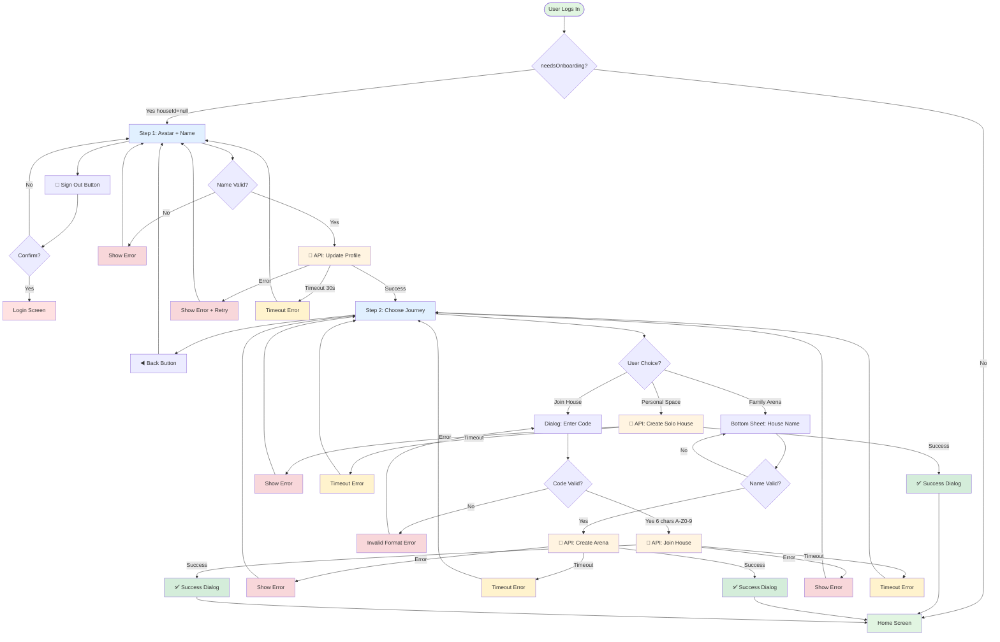
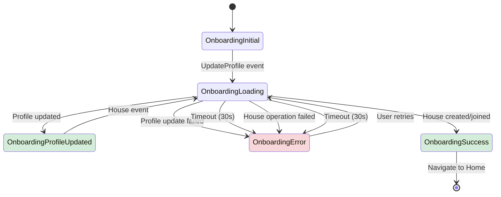
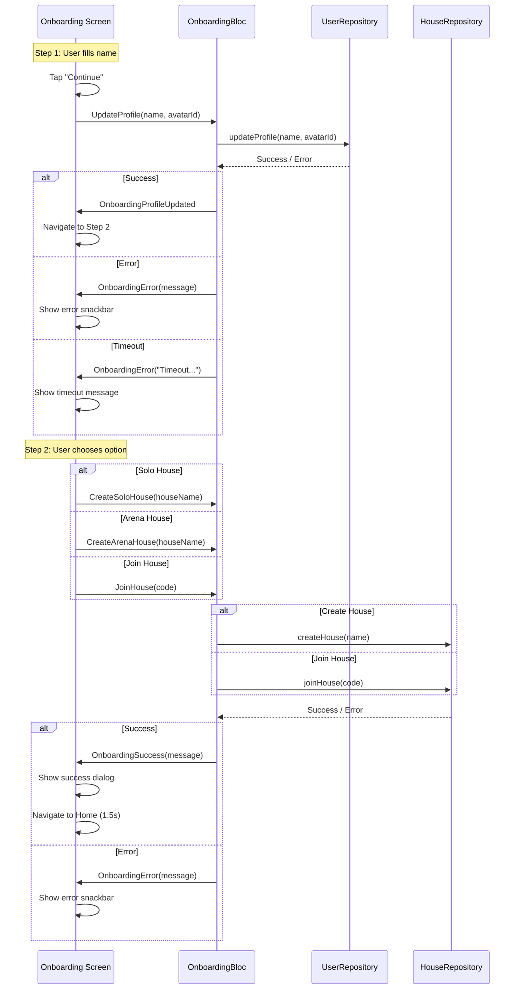
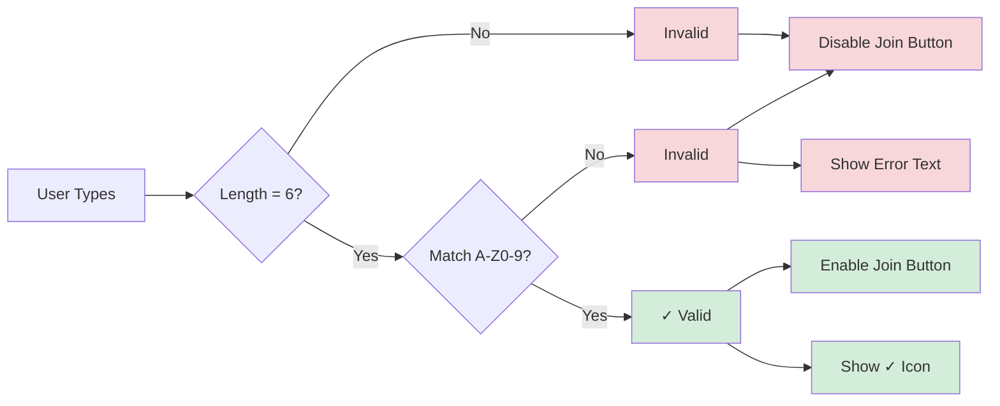

# Onboarding Flow - Updated Architecture

## Flow Diagram



## API Call Sequence

### Before Improvements
```
Solo Path:
└─ PUT /users/me (profile)
└─ POST /houses (create)

Arena Path:
└─ PUT /users/me (profile) ← DUPLICATE
└─ POST /houses (create)

Join Path:
└─ PUT /users/me (profile) ← DUPLICATE
└─ POST /houses/join (join)
```

### After Improvements
```
Step 1 → Step 2:
└─ PUT /users/me (profile) ← ONCE

Solo Path:
└─ POST /houses (create)

Arena Path:
└─ POST /houses (create)

Join Path:
└─ POST /houses/join (join)
```

**Result:** 33% fewer API calls! 🎉

## State Flow



## Event Flow



## Validation Flow

### Join Code Validation


### Name Validation
```
Input → Trim → Empty? → Invalid
                  ↓
                Not Empty → Valid → Enable Continue
```

## UI Component Tree

```
OnboardingScreen
├── BlocProvider (OnboardingBloc)
├── BlocConsumer
│   ├── Listener
│   │   ├── OnboardingProfileUpdated → Navigate to Step 2
│   │   ├── OnboardingSuccess → Success Dialog
│   │   └── OnboardingError → Error SnackBar
│   └── Builder
│       └── Scaffold
│           └── SafeArea
│               └── Stack
│                   ├── Column
│                   │   ├── Header Row
│                   │   │   ├── Sign Out / Back Button ← NEW
│                   │   │   ├── Step Indicators
│                   │   │   └── Step Counter
│                   │   ├── PageView (2 pages)
│                   │   │   ├── Page 1: Avatar + Name
│                   │   │   │   ├── Avatar Carousel
│                   │   │   │   ├── Name Input
│                   │   │   │   └── Skip Avatar Button ← NEW
│                   │   │   └── Page 2: Create Space
│                   │   │       ├── Personal Space Card
│                   │   │       ├── Divider
│                   │   │       ├── Family Arena Card
│                   │   │       └── Join Code Button
│                   │   └── Footer Space
│                   └── Positioned (Footer Button Step 1)
│                       └── Continue Button
└── Dialogs/Sheets
    ├── Sign Out Confirmation ← NEW
    ├── Arena Bottom Sheet
    ├── Join Code Dialog (Enhanced) ← IMPROVED
    └── Success Dialog
```

## Feature Matrix

| Feature | Step 1 | Step 2 |
|---------|--------|--------|
| **Navigation** | Sign Out, Continue | Back, Solo, Arena, Join |
| **Validation** | Name required | House name / code required |
| **API Calls** | Update Profile | Create/Join House |
| **Skip Option** | ✅ Skip Avatar | N/A |
| **Timeout** | ✅ 30s | ✅ 30s |
| **Error Recovery** | ✅ Retry | ✅ Retry |
| **Loading State** | ✅ Spinner | ✅ Spinner + Overlay |

## Error Scenarios

| Scenario | Timeout | Retry | Error Message |
|----------|---------|-------|---------------|
| **Network Timeout** | 30s | ✅ Yes | "Request timed out. Please check..." |
| **Invalid Join Code** | N/A | ✅ Yes | "Code must be 6 characters (A-Z, 0-9)" |
| **Profile Update Failed** | 30s | ✅ Yes | Failure message from API |
| **House Create Failed** | 30s | ✅ Yes | Failure message from API |
| **Already Has House (409)** | 30s | N/A | Treated as success |
| **Empty Name** | N/A | N/A | "Vui lòng nhập tên hiển thị" |
| **Profile Not Updated** | N/A | N/A | "Please complete your profile first" |

---

**Legend:**
- 🚪 Sign Out Button (NEW)
- ◀️ Back Button
- 📡 API Call (with timeout)
- ✅ Success
- ❌ Error

**Color Coding:**
- 🟢 Green: Success states
- 🔵 Blue: Main flow
- 🟡 Yellow: Timeout/Warning
- 🔴 Red: Error states
