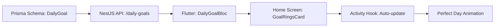
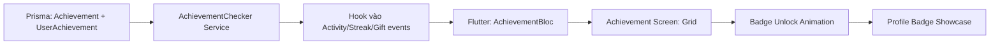
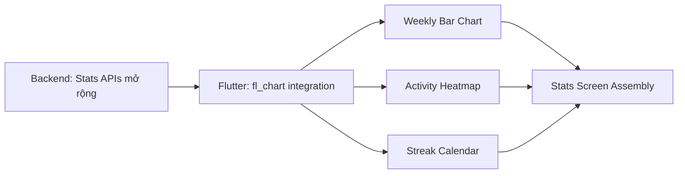

# Product Brief: ErgoLife Engagement Features Pack

**Date:** 2026-02-20
**Author:** Business Analyst (AI-assisted)
**Status:** Draft — Pending Stakeholder Review
**Version:** 1.0

---

## 1. Executive Summary

ErgoLife đã xây dựng một core loop mạnh mẽ (Task → Session → Magic Wipe → EP → Streak) với nền tảng gamification tốt (wallet EP, houses, leaderboard, gifts). Tuy nhiên, app **thiếu 3 hệ thống quan trọng** khiến user không có lý do quay lại mỗi ngày, không cảm nhận được tiến bộ dài hạn, và không thấy "tiếc" khi bỏ app.

**Đề xuất triển khai 3 tính năng:**

| # | Tính năng | Vai trò | Benchmark |
|---|-----------|---------|-----------|
| 1 | Daily Goal Rings | Lý do quay lại **mỗi ngày** | Apple Activity Rings |
| 2 | Achievement & Badge System | **Sense of progression** dài hạn | Duolingo, Strava |
| 3 | Progress Visualization | **Cảm nhận** tiến bộ, tạo emotional attachment | GitHub Heatmap, Strava |

**Timeline dự kiến:** 8–10 tuần (3 phases)
**Target:** Tăng D7 retention +25%, DAU +30%, D30 retention +20%

---

## 2. Problem Statement

### The Problem

ErgoLife users hoàn thành 1-2 activities rồi **không quay lại** vì:
1. **Không có daily target** — streak chỉ nhị phân (có/không), thiếu mục tiêu cụ thể
2. **Không feel tiến bộ** — chỉ thấy con số (tổng EP, tổng activities), không có badges hay milestones lưu lại
3. **Không visualize được journey** — stats chỉ là text, không có biểu đồ hay calendar

### Who Experiences This Problem

**Primary Users:**
- User mới (tuần 1-2): thiếu mục tiêu rõ ràng → churn vào tuần 3
- User trung thành (1-3 tháng): cảm thấy "flat" vì không có milestone mới
- User competitive: muốn "khoe" thành tích nhưng chỉ có con số EP

**Secondary Users:**
- House admins: muốn biết member nào active, cần visual tracking
- Family members: muốn thấy progress của nhau

### Current Situation

**Cách user xử lý hiện tại:**
- Dựa vào streak count (nhưng quá đơn giản)
- Xem stats screen (nhưng chỉ có số)
- Không có cách nào "khoe" thành tích ngoài leaderboard rank

**Pain Points:**
- "Tôi không biết hôm nay đã tập đủ chưa" (thiếu daily goal)
- "Tôi tập 3 tháng rồi nhưng profile giống hệt lúc mới dùng" (thiếu progression)
- "Tôi muốn xem tuần này tập hơn tuần trước bao nhiêu" (thiếu charts)

### Impact & Urgency

**Impact nếu không giải quyết:**
- Churn rate cao sau 2-3 tuần đầu (user mất motivation)
- User competitive chuyển sang Strava, Habitica
- Social features (houses, gifts) hoạt động kém vì không đủ active users

**Why Now:**
- Core loop đã stable, sẵn sàng cho tầng engagement tiếp theo
- HealthKit/Health Connect integration hoàn tất → có data cho richer stats
- Thị trường gamified wellness app đang bùng nổ 2025-2026

---

## 3. Target Users

### User Personas

#### Persona 1: "Anh Minh" — Family Dad (35 tuổi)
- **Role:** Gia trưởng, dùng ErgoLife để tạo thói quen tập thể dục + làm việc nhà cho cả nhà
- **Goals:** Muốn cả nhà cùng duy trì hoạt động hàng ngày, thấy ai tập nhiều nhất
- **Pain Points:** Không biết cả nhà đã đạt "mục tiêu ngày" chưa, không thấy trend
- **Technical Proficiency:** Trung bình, dùng iPhone + Apple Watch
- **Usage Pattern:** Sáng sớm + tối, 2-3 activities/ngày, chủ yếu fitness + housework

#### Persona 2: "Chị Linh" — Competitive Mom (30 tuổi)
- **Role:** Mẹ trẻ, hay share thành tích lên social media
- **Goals:** Muốn sưu tập badges, compete trên leaderboard, share progress
- **Pain Points:** Profile quá "phẳng", không có gì để khoe, không thấy "mình giỏi"
- **Technical Proficiency:** Cao, active trên Instagram/Facebook
- **Usage Pattern:** Đều đặn mỗi ngày, hay check leaderboard, thích challenges

#### Persona 3: "Em Hùng" — Student (22 tuổi)
- **Role:** Sinh viên, dùng app để track workout habit
- **Goals:** Build body, maintain streak, nhìn thấy progress qua charts
- **Pain Points:** Không có biểu đồ so sánh tuần-qua-tuần, thiếu accountability
- **Technical Proficiency:** Cao, dùng Android
- **Usage Pattern:** Gym sau giờ học, 1-2 activities/ngày, hay quên mở app

### User Needs (MoSCoW)

**Must Have:**
- Daily goal tracking với 3 chỉ số (EP, Duration, Activities)
- Badges/achievements khi đạt milestones (streak, EP, activity count)
- Weekly bar chart so sánh EP với tuần trước
- Streak calendar (tháng hiện tại, ngày nào active)

**Should Have:**
- Activity heatmap (giống GitHub contribution graph)
- Level/rank system (Bronze → Diamond)
- Badge showcase trên profile
- Perfect Day celebration animation

**Nice to Have:**
- Monthly report card tự động
- Category breakdown donut chart
- Share achievement card (hình đẹp cho social media)
- Rare/special badges cho events

---

## 4. Proposed Solution

### Solution Overview

Triển khai 3 hệ thống gamification layer trên nền tảng hiện có, **không thay thế** mà **bổ sung** cho core loop. Mỗi hệ thống address 1 giai đoạn trong user lifecycle:

```
Ngày 1-7       → Daily Goal Rings (tạo thói quen check app)
Ngày 7-30      → Achievement System (tạo sense of progression)
Ngày 30+       → Progress Visualization (emotional attachment)
```

### Key Capabilities

1. **Daily Goal Rings**
   - Description: 3 vòng tròn tiến trình (EP/Duration/Activities) trên Home Screen
   - User Value: Trả lời câu hỏi "Hôm nay tập đủ chưa?" — tạo clear daily target
   - Benchmark: Apple Activity Rings → 90% users duy trì hoạt động sau 3 tháng

2. **Achievement & Badge System**
   - Description: 30+ badges xếp theo tier (Bronze→Diamond), unlock khi đạt milestones
   - User Value: Tạo "sunk cost" psychology — user không muốn bỏ vì đã có nhiều badges
   - Benchmark: Duolingo badges tăng course completion +30%

3. **Progress Visualization**
   - Description: Heatmap, bar charts, streak calendar, category breakdown
   - User Value: Biến data thành story — user "thấy" mình giỏi hơn qua từng tuần
   - Benchmark: Strava progress charts là lý do #1 users mở app hàng ngày

4. **Perfect Day Mechanic**
   - Description: Close cả 3 rings → "Perfect Day" celebration + bonus EP
   - User Value: Tạo micro-celebration hàng ngày, compound dopamine effect
   - Benchmark: Apple Watch "All Rings Closed" → strongest daily engagement driver

5. **Level/Rank Progression**
   - Description: 7 levels (Beginner → Immortal) dựa trên lifetime EP
   - User Value: Long-term progression arc — luôn có "cái tiếp theo" để aim tới
   - Benchmark: Habitica RPG levels tăng retention +30% vs plain to-do apps

### What Makes This Different

ErgoLife kết hợp **3 cơ chế gamification** (goals + badges + visualization) vào 1 app đã có **social layer mạnh** (houses, gifts, leaderboard). Competitor hiện tại chỉ mạnh 1-2 trong 3:
- Apple Activity Rings: mạnh goals, không có badges sưu tập
- Strava: mạnh badges + social, không có household concept
- Habitica: mạnh RPG elements, không có health tracking
- Duolingo: mạnh streaks + badges, nhưng không phải fitness domain

**Unique Value Proposition:** Gamified family wellness app duy nhất kết hợp daily goals + achievement badges + visual progress + household social trong 1 nền tảng.

### Minimum Viable Solution (MVP)

**Core Features cho MVP:**
- Daily Goal Rings (3 rings) trên Home Screen
- 15 achievements cơ bản (streak, activity count, EP milestones, first-timer)
- Weekly bar chart (EP so sánh tuần này vs tuần trước)
- Streak calendar (tháng hiện tại)

**Deferred to Later:**
- Monthly report card
- Category breakdown donut chart
- Social sharing card
- House challenges + house goals
- Rare/seasonal badges

---

## 5. Success Metrics

### Primary Metrics

**Daily Active Users (DAU)**
- Baseline: Đo 2 tuần trước deploy
- Target: +30% sau 4 tuần
- Timeline: Week 4 post-launch
- Measurement: Firebase Analytics daily_active_users

**D7 Retention Rate**
- Baseline: Đo current D7 retention
- Target: +25%
- Timeline: Week 3 post-launch
- Measurement: Firebase Analytics retention cohort

**Average Activities/Day/User**
- Baseline: Đo current average (ước tính 1.2-1.5)
- Target: +40% (đạt 1.7-2.1)
- Timeline: Week 4 post-launch
- Measurement: Backend analytics (activities table aggregation)

### Secondary Metrics

- **Feature Adoption Rate**: 60%+ users mở Stats screen ít nhất 1 lần/tuần
- **Badge Unlock Rate**: Avg 3+ badges/user trong tháng đầu
- **Perfect Day Rate**: 20%+ ngày là "Perfect Day" (avg across users)
- **Stats Screen Views/Week**: 3+ views/user
- **D30 Retention**: +20%

### Success Criteria

**Must Achieve (sau 4 tuần):**
- DAU tăng ít nhất 20%
- 50%+ users interact với Goal Rings hàng ngày

**Should Achieve (sau 8 tuần):**
- D30 retention tăng 15%+
- Avg badges/user ≥ 5
- Stats screen adoption ≥ 50%

---

## 6. Market & Competition

### Market Context

**Market Size:** Mobile health & fitness app market ước đạt $19.3B vào 2027 (CAGR 17.6%)

**Market Trends:**
- Gamification là xu hướng #1 trong fitness app 2025-2026
- Family/household wellness apps đang tăng trưởng mạnh (post-COVID)
- Wearable integration (HealthKit, Health Connect) trở thành table stakes
- AI personalization cho daily goals đang emerging

**Target Market Segment:** Family wellness + gamified habit tracking (giao thoa 2 segments)

### Competitive Landscape

#### Competitor 1: Apple Fitness+ / Activity Rings
- **Strengths:** Goal Rings là gold standard, Apple Watch ecosystem, 28% market share
- **Weaknesses:** Không có badge sưu tập, không có family/house concept, yêu cầu Apple Watch
- **Pricing:** $9.99/tháng bundled với Apple One
- **Market Position:** Premium ecosystem play, lock-in strategy

#### Competitor 2: Duolingo (gamification benchmark)
- **Strengths:** Streak system tốt nhất ngành (tăng retention 60%), XP + leaderboard, badges tăng completion 30%
- **Weaknesses:** Không phải fitness domain, khác use case hoàn toàn
- **Pricing:** Freemium + $12.99/tháng Super
- **Market Position:** King of gamified learning, mô hình tham khảo

#### Competitor 3: Strava
- **Strengths:** Strong social (segments, kudos, clubs), achievements/badges system, data visualization
- **Weaknesses:** Focus outdoor sports (running, cycling), không có household/family concept, freemium gate
- **Pricing:** Free + $11.99/tháng Summit
- **Market Position:** Social fitness network cho outdoor athletes

#### Competitor 4: Habitica
- **Strengths:** Full RPG gamification (avatars, quests, boss fights), social guilds
- **Weaknesses:** UI phức tạp, learning curve cao, không có health tracking
- **Pricing:** Free + $4.99/tháng subscription
- **Market Position:** Niche gamified to-do app cho power users

### Competitive Advantages

**ErgoLife Advantages:**
- **Household-centric**: Unique family/house concept với invite codes — không competitor nào có tương đương
- **MET-based scoring**: EP system dựa trên khoa học (MET × duration × HR zone)
- **Magic Wipe verification**: Gamified verification mechanic (scratch-to-reveal) — unique IP
- **Diverse task types**: Cả fitness + housework + wellness — broader than pure fitness apps
- **Apple Health + Health Connect**: Cross-platform health data (iOS + Android)

**Gaps cần bổ sung (3 features này):**
- Daily Goal system (có ở Apple, thiếu ở ErgoLife)
- Achievement/Badge collection (có ở Strava/Duolingo, thiếu ở ErgoLife)
- Progress visualization (có ở mọi competitor, thiếu ở ErgoLife)

---

## 7. Technical Considerations

### Platform

**Frontend:** Flutter (iOS + Android), đã có cross-platform codebase
**Backend:** NestJS + Prisma + PostgreSQL, đã có API infrastructure
**Analytics:** Firebase Analytics (đã tích hợp)

### Required Integrations

- **Prisma Migration**: 3 new tables (DailyGoal, Achievement, UserAchievement)
- **HealthKit/Health Connect**: Reuse existing health_service.dart (đã có)
- **Firebase Analytics**: Track new events (goal_completed, badge_unlocked, stats_viewed)
- **fl_chart (pub.dev)**: New Flutter dependency cho charts

### Technical Constraints

- **Database Performance**: Heatmap query cần indexing tối ưu (90 ngày activities per user)
- **Achievement Checker**: Phải chạy async, không block activity creation flow
- **Chart Rendering**: fl_chart có thể lag trên low-end devices → cần lazy loading
- **Image Generation**: Share card cần render ảnh client-side (performance concern)

### Scale Requirements

**Expected Usage:**
- Users: 100-1000 trong 6 tháng đầu (growing)
- Transactions: ~500-5000 activities/ngày
- Data Volume: ~500KB/user/month additional (goals + achievements + heatmap cache)

**Performance Requirements:**
- Stats screen load ≤ 1.5s (cached data)
- Achievement check ≤ 200ms (async, non-blocking)
- Chart render ≤ 500ms (< 90 data points)

### Security & Compliance

**Security Requirements:**
- All APIs authenticated via JWT (existing pattern)
- Achievement unlock server-side only (anti-cheat)

**Compliance:**
- HealthKit/Health Connect data policies (existing compliance)
- GDPR: achievement data under existing user data deletion flow

---

## 8. Risks & Mitigation

### High Priority Risks

**Risk 1: Feature Creep — quá tham lam triển khai nhiều badges/charts**
- Probability: Cao
- Impact: High — delay timeline, deploy muộn
- Mitigation: MVP chỉ 15 badges + 2 charts, thêm dần sau
- Owner: Product Lead

**Risk 2: Performance Impact — nhiều chart/animation làm chậm app**
- Probability: Trung bình
- Impact: High — UX xấu → churn tăng thay vì giảm
- Mitigation: Lazy loading charts, cache heatmap data, profile trên low-end devices
- Owner: Tech Lead

**Risk 3: "Số ảo" — user gaming hệ thống để farm badges**
- Probability: Trung bình
- Impact: Medium — giảm ý nghĩa achievements
- Mitigation: Server-side validation, minimum thresholds, activity verification (Magic Wipe)
- Owner: Backend Dev

### Medium Priority Risks

- **Goal Ring design "nhàm"**: Nếu UI không đủ đẹp → user không care → cần invest UI/UX
- **Badge fatigue**: Quá nhiều notification spam → user tắt noti → limit to high-tier only
- **Data inconsistency**: Stats hiển thị khác nhau ở nhiều screen → 1 source of truth

### Assumptions

**Critical Assumptions:**
- User muốn mục tiêu hàng ngày (đã validate qua Duolingo model → 60% retention boost)
- Badge/achievement psychology hoạt động trong Vietnamese market (validate qua Duolingo VN success)
- fl_chart package đủ performance cho production use (5000+ pub.dev likes, actively maintained)

**Validation Plan:**
- A/B test Goal Rings ON/OFF cho 50% users trong 2 tuần đầu (nếu user base đủ lớn)
- Survey 10 existing users về feature preferences
- Soft launch → measure metrics → iterate

---

## 9. Resource Estimates

### Team Requirements

- **Flutter Developer**: 70% allocation (6-8 tuần) — Goal Rings UI, Stats screen, Badge screen
- **Backend Developer**: 50% allocation (5-6 tuần) — New APIs, Prisma schemas, Achievement checker
- **UI/UX Designer**: 30% allocation (2-3 tuần) — Ring design, Badge icons, Chart layout
- **QA/Testing**: 20% allocation (2 tuần) — Cross-platform testing, performance profiling

### Timeline Estimate

**Phase 1 — Daily Goal Rings (Tuần 1-3):**
- Backend: DailyGoal schema + API endpoints (3 ngày)
- Frontend: Goal Ring widget + Home Screen integration (5 ngày)
- Backend: Auto-update goals on activity completion (2 ngày)
- Frontend: Settings screen for custom targets (2 ngày)
- Testing + Polish (3 ngày)

**Phase 2 — Achievement System (Tuần 4-6):**
- Backend: Achievement + UserAchievement schema (2 ngày)
- Backend: Achievement Checker service (4 ngày)
- Backend: Seed 15 initial achievements (1 ngày)
- Frontend: Achievement screen (grid + detail) (5 ngày)
- Frontend: Badge unlock animation (2 ngày)
- Frontend: Profile badge showcase (2 ngày)
- Testing + Polish (3 ngày)

**Phase 3 — Progress Visualization (Tuần 7-9):**
- Backend: Stats APIs (heatmap, weekly comparison, calendar) (4 ngày)
- Frontend: Weekly bar chart (3 ngày)
- Frontend: Activity heatmap (3 ngày)
- Frontend: Streak calendar (2 ngày)
- Frontend: Stats screen assembly + navigation (2 ngày)
- Testing + Polish (3 ngày)

**Buffer:** Tuần 10 — Bug fixes, performance optimization, final QA

**Total Estimated Duration:** 10 tuần

---

## 10. Dependencies

### Internal Dependencies

- **Existing Activity API**: Achievement checker triggers after `createActivity()` — cần hook
- **Existing Stats API**: Mở rộng `/stats/summary` — backward compatible
- **Home Screen**: Thêm Goal Ring card — cần refactor HomeLoaded state

### External Dependencies

- **fl_chart package**: New Flutter dependency (pub.dev, MIT license)
- **Lottie animations**: Cần design 3-5 animation files (badge unlock, ring close, perfect day)
- **Badge icon assets**: 30+ icon designs (có thể dùng emoji + custom SVG)

### Blockers

**Current Blockers:**
- Không có blocker nghiêm trọng — cả 3 features build on existing infrastructure
- fl_chart compatibility cần verify với Flutter SDK 3.10.1

**Resolution Plan:**
- Verify fl_chart compatibility trong Sprint 0 (1 ngày spike)
- Badge icons: dùng emoji cho MVP, custom design cho v2

---

## 11. Implementation Strategy

### Phase 1: Daily Goal Rings (Tuần 1-3)



**Backend Tasks:**
1. Prisma migration: `DailyGoal` + `UserGoalSettings` tables
2. `DailyGoalsModule` (NestJS): CRUD endpoints + auto-update logic
3. Hook vào `ActivitiesService.create()` → update daily goal progress
4. Check Perfect Day → trigger notification

**Frontend Tasks:**
1. `DailyGoalModel` + `DailyGoalRepository`
2. `DailyGoalBloc` (events: LoadTodayGoal, UpdateProgress, ClosedRing)
3. `GoalRingsCard` widget (3 concentric rings, animated fill)
4. Goal Settings trong Profile/Settings screen
5. Perfect Day celebration overlay (Lottie + confetti)

---

### Phase 2: Achievement System (Tuần 4-6)



**Backend Tasks:**
1. Prisma migration: `Achievement`, `AchievementTier`, `UserAchievement`
2. Seed 15 achievements với 4 tiers each
3. `AchievementCheckerService` — fire-and-forget async checks
4. Hook points: `createActivity`, `updateStreak`, `sendGift`, `joinHouse`
5. API: `/achievements`, `/achievements/me`, `/achievements/me/pinned`

**Frontend Tasks:**
1. `AchievementModel` + `AchievementRepository`
2. `AchievementBloc`
3. `AchievementScreen` (grid layout, filter by category, locked/unlocked)
4. `BadgeDetailSheet` (bottom sheet with tier progress)
5. `BadgeUnlockOverlay` (full-screen Lottie animation)
6. Profile → `PinnedBadges` section (max 3 badges)

---

### Phase 3: Progress Visualization (Tuần 7-9)



**Backend Tasks:**
1. `/stats/heatmap?months=3` — daily EP aggregation
2. `/stats/weekly-comparison` — current vs previous week
3. `/stats/calendar?month=2026-02` — day-by-day status
4. Indexing optimization trên activities table

**Frontend Tasks:**
1. Add `fl_chart` dependency
2. `WeeklyProgressChart` widget (BarChart, toggle EP/Duration/Activities)
3. `ActivityHeatmap` widget (custom GridView + color-coded cells)
4. `StreakCalendar` widget (month grid with status icons)
5. `StatsScreen` assembly (SegmentedControl + scrollable sections)
6. Navigation: Home → Stats, Profile → Stats

---

## 12. Verification Plan

### Automated Tests

**Backend:**
```bash
# Run NestJS tests for new modules
cd backend && npm run test -- --testPathPattern="daily-goals|achievements|stats"
```
- Unit tests cho DailyGoalsService (create, update, auto-calculate)
- Unit tests cho AchievementCheckerService (trigger conditions)
- Integration tests cho new API endpoints

**Frontend:**
```bash
# Run Flutter tests
cd app && flutter test
```
- Widget tests cho GoalRingsCard, AchievementScreen, WeeklyProgressChart
- BLoC tests cho DailyGoalBloc, AchievementBloc
- Model tests cho DailyGoalModel, AchievementModel

### Manual Verification

1. **Goal Rings Flow**: Mở app → thấy 3 rings trên Home → hoàn thành activity → rings fill animation → close ring 100% → celebration
2. **Achievement Unlock**: Hoàn thành 1 activity → check badge "First Timer" hiện → tap để xem detail → thấy trên Profile
3. **Stats Screen**: Navigate tới Stats → thấy weekly bar chart → swipe xem streak calendar → tap heatmap cell → thấy tooltip
4. **Cross-platform**: Test trên cả iOS simulator và Android emulator
5. **Performance**: Stats screen load ≤ 1.5s với 90 ngày data

---

## 13. Next Steps

### Immediate Actions

1. **Sprint 0 (1 ngày)**: Verify fl_chart compatibility + spike Goal Ring custom widget
2. **Stakeholder approval**: Review product brief → approve scope → start Phase 1
3. **Design**: Goal Ring color palette + Badge icon set (parallel với backend)

### Recommended Phases

```
Tuần 1-3  → Phase 1: Daily Goal Rings (deploy + measure)
Tuần 4-6  → Phase 2: Achievement System (deploy + measure)
Tuần 7-9  → Phase 3: Progress Visualization (deploy + measure)
Tuần 10   → Buffer: Bug fixes + performance optimization
Tuần 11+  → Iterate: Monthly report, share cards, house challenges
```

**Handoff To:** Product Manager → Tech Lead → Development Sprint

**Required Before Moving Forward:**
- Stakeholder approval on scope (MVP vs full)
- Badge icon designs (minimum 15 cho MVP)
- fl_chart spike confirmation
- Lottie animation files (ring close, badge unlock, perfect day)

---

## Appendix

### Research Sources

- Apple Activity Rings → 90% users maintain activity level through March (Apple Heart Study, 250K+ participants)
- Duolingo streaks → 60% retention boost, badges → 30% completion boost (orizon.co)
- Habitica gamification → 30% higher retention vs plain to-do apps (trophy.so)
- Strava segments/badges → primary daily engagement driver (strivecloud.io)
- Mobile fitness app market → $19.3B by 2027, CAGR 17.6%

### Feature Documents (Chi tiết)

- [feature-daily-goal-rings.md](file:///Users/anhtu/MySpace/Personal%20Project/ErgoLifeApp/documents/feature-daily-goal-rings.md) — Schema, API, UI/UX chi tiết
- [feature-achievement-badges.md](file:///Users/anhtu/MySpace/Personal%20Project/ErgoLifeApp/documents/feature-achievement-badges.md) — 30+ badges, tier system, checker logic
- [feature-progress-visualization.md](file:///Users/anhtu/MySpace/Personal%20Project/ErgoLifeApp/documents/feature-progress-visualization.md) — 4 chart components, fl_chart integration

---

**Document Status:** Draft — Pending Stakeholder Review
**Last Updated:** 2026-02-20
**Next Review Date:** After stakeholder feedback
