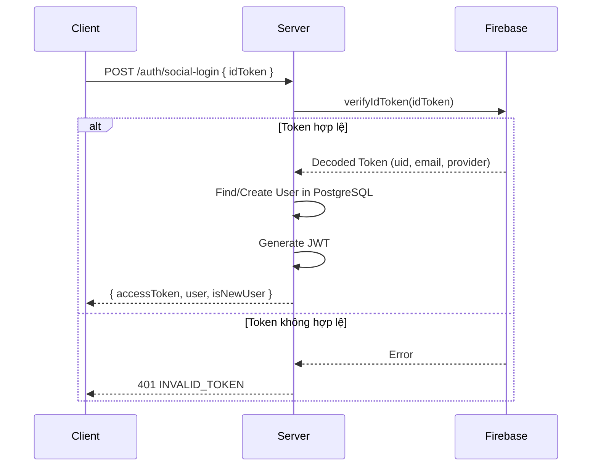

# API: Authentication

## Endpoints

---

## POST `/auth/social-login`

Đăng nhập bằng Firebase ID Token (từ Google/Apple Sign-in).

### Request

**Headers:**
```http
Content-Type: application/json
```

**Body:**
```json
{
  "idToken": "eyJhbGciOiJSUzI1NiIsInR5cCI6..."
}
```

| Field | Type | Required | Description |
|-------|------|----------|-------------|
| idToken | string | ✅ | Firebase ID Token từ client |

### Response

**Success (200):**
```json
{
  "success": true,
  "data": {
    "accessToken": "eyJhbGciOiJIUzI1NiIsInR5cCI6IkpXVCJ9...",
    "user": {
      "id": "550e8400-e29b-41d4-a716-446655440000",
      "firebaseUid": "abc123xyz",
      "email": "user@gmail.com",
      "displayName": "Minh Nguyen",
      "avatarId": 3,
      "houseId": null,
      "walletBalance": 0,
      "provider": "GOOGLE"
    },
    "isNewUser": false
  }
}
```

| Field | Type | Description |
|-------|------|-------------|
| accessToken | string | JWT để dùng cho các requests tiếp theo |
| user | object | Thông tin user |
| isNewUser | boolean | `true` nếu vừa tạo tài khoản mới |

**Error (401):**
```json
{
  "success": false,
  "error": {
    "code": "INVALID_TOKEN",
    "message": "Firebase ID token is invalid or expired"
  }
}
```

### Flow Diagram



---

## GET `/auth/me`

Lấy thông tin user hiện tại.

### Request

**Headers:**
```http
Authorization: Bearer <access_token>
```

### Response

**Success (200):**
```json
{
  "success": true,
  "data": {
    "id": "550e8400-e29b-41d4-a716-446655440000",
    "firebaseUid": "abc123xyz",
    "email": "user@gmail.com",
    "displayName": "Minh Nguyen",
    "avatarId": 3,
    "houseId": "660e8400-e29b-41d4-a716-446655441111",
    "walletBalance": 2500,
    "provider": "GOOGLE",
    "house": {
      "id": "660e8400-e29b-41d4-a716-446655441111",
      "name": "Nhà của Mèo",
      "memberCount": 2
    }
  }
}
```

**Error (401):**
```json
{
  "success": false,
  "error": {
    "code": "UNAUTHORIZED",
    "message": "Invalid or expired token"
  }
}
```

---

## POST `/auth/logout`

Đăng xuất và invalidate FCM token (optional).

### Request

**Headers:**
```http
Authorization: Bearer <access_token>
```

### Response

**Success (200):**
```json
{
  "success": true,
  "data": {
    "message": "Logged out successfully"
  }
}
```

> **Note:** JWT vẫn valid về mặt kỹ thuật cho đến khi hết hạn. Client có trách nhiệm xóa token khỏi local storage.
