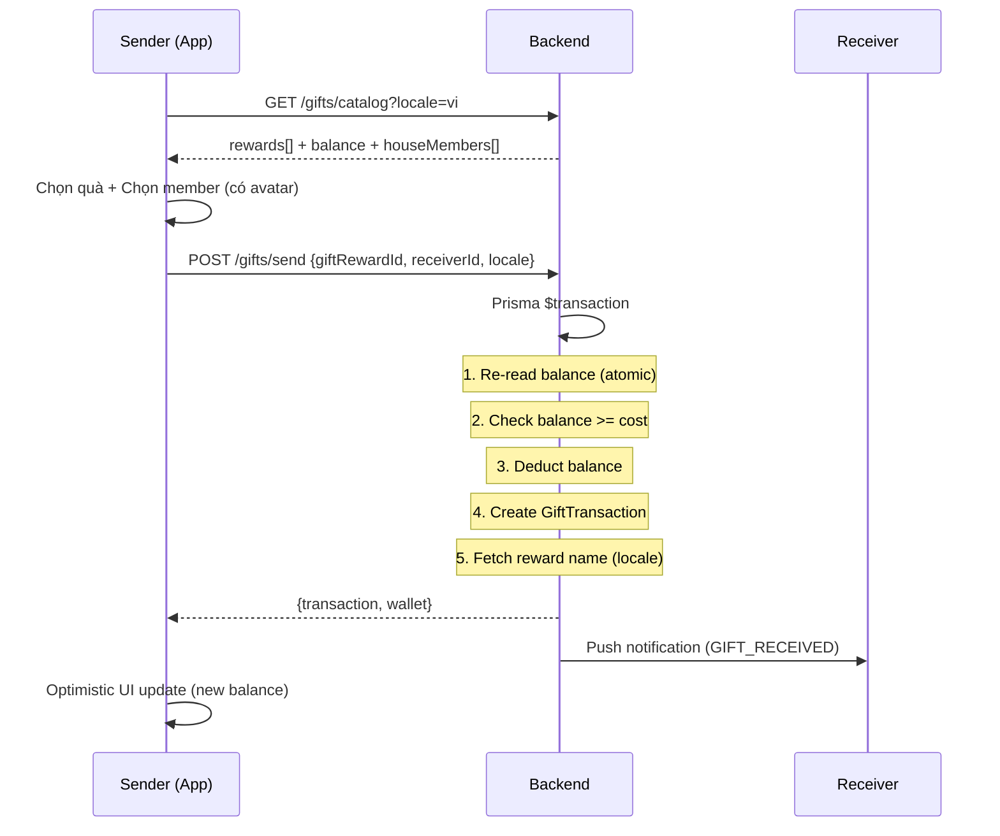

# API: Family Gifting

## Tổng quan

Hệ thống quà tặng tượng trưng trong gia đình. Thành viên dùng ErgoPoints để gửi quà cho nhau, tương tác tích cực và khuyến khích lẫn nhau.

---

## GET `/gifts/catalog`

Lấy danh sách quà tặng, EP balance, và danh sách thành viên trong nhà.

### Request

**Headers:**
```http
Authorization: Bearer <access_token>
```

**Query Parameters:**
| Param | Type | Default | Description |
|-------|------|---------|-------------|
| locale | string | `vi` | Ngôn ngữ cho tên/mô tả quà. Fallback sang `en` nếu không có bản dịch |

### Response

**Success (200):**
```json
{
  "rewards": [
    {
      "id": "uuid-reward-1",
      "key": "gold_star",
      "name": "Ngôi sao Vàng ⭐",
      "description": "Trao ngôi sao vàng cho sự cố gắng!",
      "icon": "⭐",
      "cost": 200,
      "category": "PRAISE"
    }
  ],
  "userBalance": 3270,
  "houseMembers": [
    {
      "id": "uuid-member-1",
      "displayName": "Lan Trần",
      "avatarId": 5
    },
    {
      "id": "uuid-member-2",
      "displayName": "Minh Nguyễn",
      "avatarId": 12
    }
  ]
}
```

### Notes
- `houseMembers` **không bao gồm** user hiện tại
- `avatarId` dùng để render avatar 3D (DiceBear) phía client
- Nếu `locale` không có bản dịch, fallback sang `en`
- Rewards sắp xếp theo `category ASC, sortOrder ASC`

---

## POST `/gifts/send`

Gửi quà tặng cho thành viên trong nhà. EP bị trừ từ sender.

### Request

**Headers:**
```http
Authorization: Bearer <access_token>
Content-Type: application/json
```

**Body:**
```json
{
  "giftRewardId": "uuid-reward-1",
  "receiverId": "uuid-member-1",
  "message": "Cảm ơn em đã dọn nhà!",
  "locale": "vi"
}
```

| Field | Type | Required | Validation |
|-------|------|----------|------------|
| giftRewardId | UUID | ✅ | Phải tồn tại và `isActive = true` |
| receiverId | UUID | ✅ | Phải cùng house, không phải chính mình |
| message | string | ❌ | Tối đa 100 ký tự |
| locale | string | ❌ | Ngôn ngữ cho reward name snapshot (default: `vi`) |

### Response

**Success (200):**
```json
{
  "transaction": {
    "id": "uuid-transaction",
    "senderId": "uuid-sender",
    "receiverId": "uuid-receiver",
    "rewardName": "Ngôi sao Vàng ⭐",
    "rewardIcon": "⭐",
    "pointsSpent": 200,
    "message": "Cảm ơn em đã dọn nhà!",
    "createdAt": "2026-02-11T07:30:00.000Z",
    "sender": { "id": "uuid-sender", "displayName": "Minh" },
    "receiver": { "id": "uuid-receiver", "displayName": "Lan" }
  },
  "wallet": {
    "previousBalance": 3270,
    "pointsSpent": 200,
    "newBalance": 3070
  }
}
```

**Error (422) — Không đủ EP:**
```json
{
  "statusCode": 422,
  "message": "Insufficient balance. You have 100 EP but need 200 EP"
}
```

**Error (400) — Gửi cho chính mình:**
```json
{
  "statusCode": 400,
  "message": "Cannot send a gift to yourself"
}
```

### Side Effects
- Push notification `GIFT_RECEIVED` gửi đến receiver
- Notification content: `"[Sender] đã gửi cho bạn [Gift Name]! 🎁"`
- Balance check **atomic** trong Prisma `$transaction` (chống race condition)
- `rewardName` snapshot lưu theo `locale` của sender (fallback `vi`)

### Business Rules
- BR-30: Sender và receiver phải cùng house
- BR-31: Không thể gửi quà cho chính mình
- BR-32: Balance check trong transaction block (chống race condition)
- BR-33: Reward name snapshot theo locale sender

---

## GET `/gifts/history`

Lịch sử gửi/nhận quà, phân trang.

### Request

**Headers:**
```http
Authorization: Bearer <access_token>
```

**Query Parameters:**
| Param | Type | Default | Description |
|-------|------|---------|-------------|
| type | `sent` \| `received` | null (tất cả) | Lọc theo chiều |
| page | number | 1 | Trang |
| limit | number | 20 | Số items/trang |

### Response

**Success (200):**
```json
{
  "gifts": [
    {
      "id": "uuid-transaction",
      "rewardName": "Ngôi sao Vàng ⭐",
      "rewardIcon": "⭐",
      "pointsSpent": 200,
      "message": "Cảm ơn em đã dọn nhà!",
      "createdAt": "2026-02-11T07:30:00.000Z",
      "sender": {
        "id": "uuid-sender",
        "displayName": "Minh",
        "avatarId": 12
      },
      "receiver": {
        "id": "uuid-receiver",
        "displayName": "Lan",
        "avatarId": 5
      }
    }
  ],
  "total": 45,
  "hasMore": true
}
```

### Client-side Behavior
- **Infinite scroll**: Client theo dõi `hasMore` và `currentPage`
- Khi scroll gần cuối danh sách → load page tiếp theo
- Items mới được **append** vào danh sách hiện tại (không replace)
- Loading indicator ở cuối list khi đang fetch thêm

---

## Gift Reward Categories

| Category | Mô tả | Ví dụ |
|----------|--------|-------|
| `PRAISE` | Lời khen & Công nhận | ⭐ Ngôi sao Vàng, 👏 Siêu sao, 🏅 Huy chương |
| `PRIVILEGE` | Đặc quyền gia đình | 👑 Vua/Nữ hoàng, 🎮 Game time |
| `EXPERIENCE` | Trải nghiệm vui | 🍕 Pizza party, ☕ Cà phê đặc biệt |
| `MOTIVATION` | Động viên & Tinh thần | 💪 Cố lên!, 🌟 Tỏa sáng, 🔥 Bùng cháy |

---

## Flow Diagram


