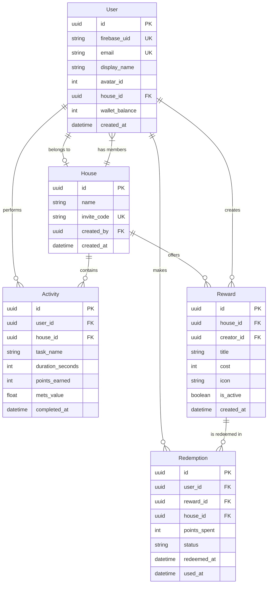

# Database Architecture Overview

## Tổng quan

**Database**: PostgreSQL  
**ORM**: Prisma  
**Backend**: NestJS

Ứng dụng ErgoLife sử dụng PostgreSQL làm database chính, quản lý qua Prisma ORM. Kiến trúc tập trung vào đơn vị "House" (Nhà) - nơi các thành viên chia sẻ công việc, điểm số, và phần thưởng.

---

## Core Entities

| Entity | Mô tả | Quan hệ chính |
|--------|-------|---------------|
| **User** | Người dùng ứng dụng | Thuộc 1 House, có nhiều Activities |
| **House** | Hộ gia đình/nhóm | Có nhiều Users (max 4) |
| **Activity** | Log việc nhà đã làm | Thuộc User và House |
| **Reward** | Coupon phần thưởng | Thuộc House |
| **Redemption** | Log đổi thưởng | Thuộc User, liên kết Reward |

---

## Entity Relationship Diagram

---

## Relationships Summary

### 1. User ↔ House (Many-to-One)
- Một User thuộc về tối đa 1 House
- Một House có tối đa 4 Users
- User có thể không thuộc House nào (`house_id = NULL`)

### 2. User → Activity (One-to-Many)
- Một User có nhiều Activities
- Activity luôn thuộc về 1 User

### 3. House → Activity (One-to-Many)  
- Tất cả Activities trong House được track để hiển thị Leaderboard
- Denormalized `house_id` trong Activity để query nhanh

### 4. House → Reward (One-to-Many)
- Rewards là "local" cho mỗi House
- Mỗi House có shop riêng

### 5. User → Redemption (One-to-Many)
- Track lịch sử đổi thưởng của từng User

### 6. Reward → Redemption (One-to-Many)
- Một Reward có thể được đổi nhiều lần (unlimited stock)

---

## Design Decisions

### Tại sao dùng UUID thay vì Auto-increment?
- Tránh expose internal IDs
- Dễ dàng merge data nếu cần
- Works well với distributed systems

### Tại sao denormalize `house_id` trong Activity?
- Query performance: Lấy tất cả activities của House mà không cần JOIN
- Leaderboard updates cần query thường xuyên

### Tại sao lưu `reward_snapshot` trong Redemption?
- Giữ lại thông tin Reward tại thời điểm đổi
- Reward có thể bị sửa/xóa sau đó nhưng History vẫn chính xác

---

## Indexes

| Table | Columns | Type | Purpose |
|-------|---------|------|---------|
| users | firebase_uid | UNIQUE | Firebase auth lookup |
| users | email | UNIQUE | Prevent duplicates |
| users | house_id | INDEX | Find house members |
| houses | invite_code | UNIQUE | Join house by code |
| activities | house_id, completed_at | COMPOSITE | Leaderboard queries |
| activities | user_id, completed_at | COMPOSITE | User history |
| rewards | house_id, is_active | COMPOSITE | Shop listing |
| redemptions | user_id, redeemed_at | COMPOSITE | User purchase history |
