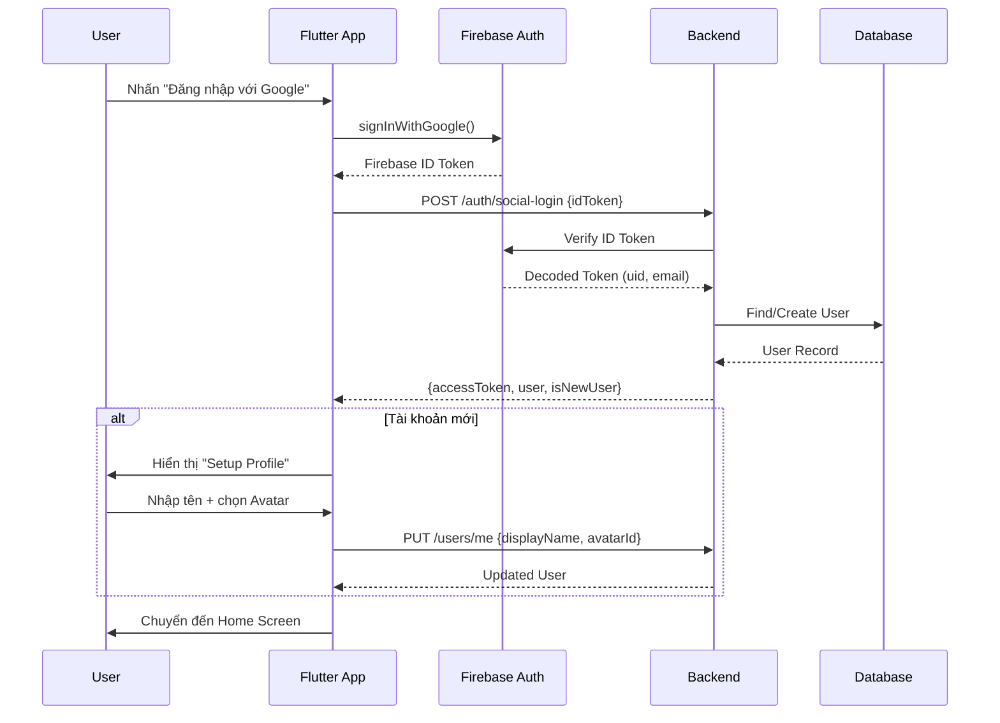

# Use Cases: Authentication & Onboarding

## Tổng quan Module
Module xử lý đăng nhập/đăng ký người dùng thông qua Social Authentication (Google/Apple) và thiết lập hồ sơ ban đầu.

---

## UC-01: Đăng nhập (Sign In)

| Thuộc tính | Giá trị |
|------------|---------|
| **ID** | UC-01 |
| **Tên** | Đăng nhập |
| **Actor** | Guest User |
| **Mô tả** | Người dùng đăng nhập vào ứng dụng bằng Google hoặc Apple ID |

### Preconditions
- Ứng dụng đã được cài đặt
- Thiết bị có kết nối internet
- Người dùng có tài khoản Google hoặc Apple

### Main Flow
1. Người dùng mở ứng dụng
2. Hệ thống hiển thị màn hình Welcome với 2 options:
   - "Đăng nhập bằng Google"
   - "Đăng nhập bằng Apple"
3. Người dùng chọn phương thức đăng nhập
4. Hệ thống chuyển hướng đến trang xác thực của provider
5. Người dùng xác thực với provider
6. Provider trả về ID Token cho ứng dụng
7. Ứng dụng gửi ID Token đến Backend
8. Backend verify token và kiểm tra tài khoản:
   - **Nếu tài khoản đã tồn tại**: Trả về JWT + User info → Chuyển đến Home
   - **Nếu tài khoản mới**: Tạo User record → Trả về JWT → Chuyển đến UC-02 (Setup Profile)

### Alternative Flows

#### AF-01.1: Xác thực thất bại
- **Điều kiện**: Provider từ chối xác thực (sai mật khẩu, hủy bỏ)
- **Xử lý**: Hiển thị thông báo lỗi, quay lại màn hình Welcome

#### AF-01.2: Không có kết nối mạng
- **Điều kiện**: Thiết bị mất kết nối trong quá trình xác thực
- **Xử lý**: Hiển thị thông báo "Vui lòng kiểm tra kết nối mạng"

### Postconditions
- **Success**: Người dùng được xác thực, JWT được lưu trữ local
- **Failure**: Người dùng vẫn ở trạng thái Guest

### Business Rules
- BR-01: Chỉ hỗ trợ Google và Apple Sign-in (không có Email/Password)
- BR-02: Một email chỉ được liên kết với một tài khoản

---

## UC-02: Thiết lập Hồ sơ (Setup Profile)

| Thuộc tính | Giá trị |
|------------|---------|
| **ID** | UC-02 |
| **Tên** | Thiết lập Hồ sơ |
| **Actor** | New User |
| **Mô tả** | Người dùng mới thiết lập tên hiển thị và avatar |

### Preconditions
- Người dùng đã xác thực thành công (UC-01)
- Người dùng chưa có profile data (tài khoản mới)

### Main Flow
1. Hệ thống hiển thị màn hình "Create Your Profile"
2. Người dùng nhập Display Name (tên hiển thị)
3. Hệ thống hiển thị bộ sưu tập 3D Avatar
4. Người dùng chọn một Avatar
5. Người dùng nhấn nút "Xác nhận" / "Bắt đầu"
6. Hệ thống cập nhật User Profile lên Backend
7. Hệ thống chuyển đến màn hình Home (hoặc House Setup nếu chưa có nhà)

### Alternative Flows

#### AF-02.1: Tên hiển thị không hợp lệ
- **Điều kiện**: Tên rỗng hoặc chứa ký tự không hợp lệ
- **Xử lý**: Hiển thị validation error, không cho phép continue

#### AF-02.2: Bỏ qua chọn Avatar
- **Điều kiện**: Người dùng không chọn avatar
- **Xử lý**: Hệ thống gán Avatar mặc định

### Postconditions
- User Profile được lưu với `display_name` và `avatar_id`

### Business Rules
- BR-03: Display Name: 2-30 ký tự, không chứa emoji hoặc ký tự đặc biệt
- BR-04: Avatar được chọn từ thư viện có sẵn (MVP không hỗ trợ upload ảnh)

---

## UC-03: Đăng xuất (Sign Out)

| Thuộc tính | Giá trị |
|------------|---------|
| **ID** | UC-03 |
| **Tên** | Đăng xuất |
| **Actor** | Authenticated User |
| **Mô tả** | Người dùng đăng xuất khỏi ứng dụng |

### Preconditions
- Người dùng đã đăng nhập

### Main Flow
1. Người dùng mở Settings
2. Người dùng nhấn "Đăng xuất"
3. Hệ thống hiển thị dialog xác nhận
4. Người dùng xác nhận
5. Hệ thống xóa JWT và session data local
6. Hệ thống chuyển về màn hình Welcome

### Postconditions
- JWT bị xóa khỏi local storage
- Người dùng trở về trạng thái Guest

---

## Sequence Diagram

