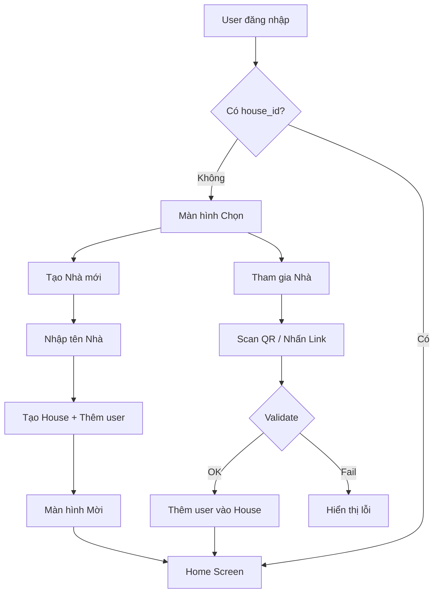

# Use Cases: Household Management

## Tổng quan Module
Module quản lý "Nhà" - đơn vị tổ chức chính trong ứng dụng. Mỗi người dùng thuộc về một Nhà, và các thành viên trong Nhà chia sẻ bảng xếp hạng, phần thưởng.

---

## UC-04: Tạo Nhà mới (Create House)

| Thuộc tính | Giá trị |
|------------|---------|
| **ID** | UC-04 |
| **Tên** | Tạo Nhà mới |
| **Actor** | User (chưa có Nhà) |
| **Mô tả** | Người dùng tạo một hộ gia đình mới để mời người khác tham gia |

### Preconditions
- Người dùng đã đăng nhập
- Người dùng CHƯA thuộc về bất kỳ Nhà nào (`house_id = null`)

### Main Flow
1. Người dùng nhấn "Tạo Nhà mới"
2. Hệ thống hiển thị form nhập thông tin:
   - Tên Nhà (bắt buộc)
3. Người dùng nhập tên (VD: "Nhà của Mèo & Cún")
4. Người dùng nhấn "Tạo"
5. Hệ thống tạo House document với `house_id` duy nhất
6. Hệ thống cập nhật User với `house_id` mới
7. Hệ thống hiển thị màn hình "Mời Thành viên" (UC-05)

### Postconditions
- House mới được tạo trong database
- User trở thành thành viên đầu tiên và owner của House

### Business Rules
- BR-05: Một User chỉ thuộc về 1 House tại một thời điểm
- BR-06: Tên Nhà: 2-50 ký tự

---

## UC-05: Mời Thành viên (Invite Member)

| Thuộc tính | Giá trị |
|------------|---------|
| **ID** | UC-05 |
| **Tên** | Mời Thành viên |
| **Actor** | House Member |
| **Mô tả** | Tạo QR Code hoặc Link mời để chia sẻ |

### Preconditions
- Người dùng đã thuộc về một House
- House chưa đạt giới hạn thành viên (< 4 người)

### Main Flow
1. Người dùng mở màn hình House Settings
2. Người dùng nhấn "Mời Thành viên"
3. Hệ thống tạo invite code / deep link chứa `house_id`
4. Hệ thống hiển thị:
   - QR Code để scan
   - Nút "Chia sẻ Link"
5. Người dùng chia sẻ qua tin nhắn, email, hoặc để đối phương scan

### Alternative Flows

#### AF-05.1: House đã đầy
- **Điều kiện**: House đã có 4 thành viên
- **Xử lý**: Hiển thị thông báo "Nhà đã đạt giới hạn thành viên"

### Postconditions
- Invite link/QR được tạo và sẵn sàng chia sẻ

### Business Rules
- BR-07: Tối đa 4 thành viên/House
- BR-08: Invite link có thời hạn 7 ngày

---

## UC-06: Tham gia Nhà (Join House)

| Thuộc tính | Giá trị |
|------------|---------|
| **ID** | UC-06 |
| **Tên** | Tham gia Nhà |
| **Actor** | User (chưa có Nhà) |
| **Mô tả** | Người dùng tham gia một Nhà hiện có thông qua mã mời |

### Preconditions
- Người dùng đã đăng nhập
- Người dùng CHƯA thuộc về bất kỳ Nhà nào
- Có invite link/QR hợp lệ

### Main Flow
1. Người dùng scan QR Code hoặc nhấn vào Deep Link
2. Ứng dụng mở và hiển thị thông tin Nhà:
   - Tên Nhà
   - Số thành viên hiện tại
   - Danh sách avatar thành viên
3. Người dùng nhấn "Tham gia"
4. Hệ thống validate:
   - House tồn tại
   - Số thành viên < 4
   - User chưa thuộc House khác
5. Hệ thống thêm User vào `member_uids` của House
6. Hệ thống cập nhật `house_id` cho User
7. Hệ thống chuyển đến Home Screen

### Alternative Flows

#### AF-06.1: Link không hợp lệ
- **Điều kiện**: `house_id` không tồn tại hoặc link hết hạn
- **Xử lý**: Hiển thị "Link đã hết hạn hoặc không hợp lệ"

#### AF-06.2: House đã đầy
- **Điều kiện**: House đã có 4 thành viên
- **Xử lý**: Hiển thị "Nhà này đã đạt giới hạn thành viên"

#### AF-06.3: Đã thuộc House khác
- **Điều kiện**: User đã có `house_id`
- **Xử lý**: Hiển thị "Bạn cần rời Nhà hiện tại trước khi tham gia Nhà mới"

### Postconditions
- User được thêm vào House
- User xuất hiện trên Bảng xếp hạng của House

---

## UC-07: Rời Nhà (Leave House)

| Thuộc tính | Giá trị |
|------------|---------|
| **ID** | UC-07 |
| **Tên** | Rời Nhà |
| **Actor** | House Member |
| **Mô tả** | Người dùng rời khỏi Nhà hiện tại |

### Preconditions
- Người dùng đang thuộc về một House

### Main Flow
1. Người dùng mở House Settings
2. Người dùng nhấn "Rời Nhà"
3. Hệ thống hiển thị cảnh báo:
   - "Bạn sẽ mất tất cả điểm và lịch sử trong Nhà này"
4. Người dùng xác nhận
5. Hệ thống xóa User khỏi `member_uids` của House
6. Hệ thống set `house_id = null` cho User
7. Hệ thống reset `wallet_balance = 0`
8. Hệ thống chuyển về màn hình "Tạo/Tham gia Nhà"

### Alternative Flows

#### AF-07.1: Là thành viên cuối cùng
- **Điều kiện**: House chỉ còn 1 thành viên
- **Xử lý**: 
  - Cảnh báo "Nhà sẽ bị xóa vĩnh viễn"
  - Nếu xác nhận: Xóa House và tất cả data liên quan

### Postconditions
- User không còn thuộc House
- Điểm và lịch sử hoạt động được giữ lại trong Activities (cho analytics)
- Wallet balance reset về 0

### Business Rules
- BR-09: Khi rời nhà, balance bị reset nhưng activities history được giữ
- BR-10: Nếu là thành viên cuối cùng, House bị xóa hoàn toàn

---

## Flow Diagram

