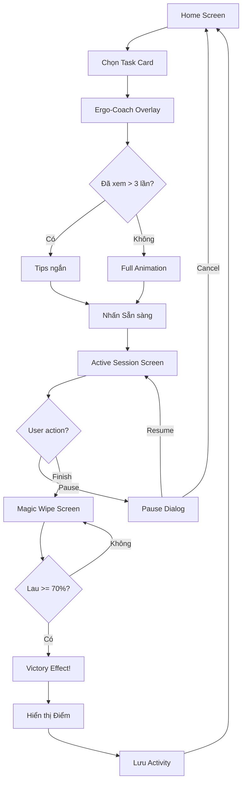
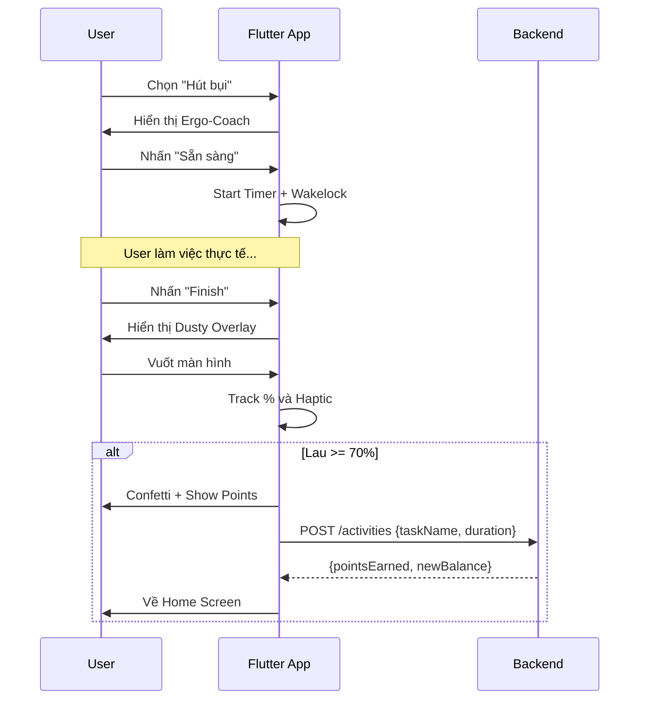

# Use Cases: Core Loop (Chores as Workout)

## Tổng quan Module
Module cốt lõi của ứng dụng - vòng lặp: **Chọn việc → Xem hướng dẫn → Làm việc → Xác nhận hoàn thành → Nhận điểm**. Đây là nơi người dùng "biến việc nhà thành bài tập".

---

## UC-08: Xem danh sách Công việc (Browse Tasks)

| Thuộc tính | Giá trị |
|------------|---------|
| **ID** | UC-08 |
| **Tên** | Xem danh sách Công việc |
| **Actor** | House Member |
| **Mô tả** | Người dùng xem các công việc nhà có sẵn để chọn |

### Preconditions
- Người dùng đã đăng nhập
- Người dùng thuộc về một House

### Main Flow
1. Người dùng mở Home Screen
2. Hệ thống hiển thị danh sách Task dạng Grid (2 cột)
3. Mỗi Card hiển thị:
   - Icon công việc
   - Tên công việc
   - Điểm ước tính/phút (METs)
4. Người dùng có thể scroll để xem tất cả

### Danh sách Task (MVP - Hard-coded)

| # | Task Name | METs | Icon |
|---|-----------|------|------|
| 1 | Hút bụi | 3.5 | 🧹 |
| 2 | Lau nhà | 3.0 | 🧽 |
| 3 | Rửa bát | 2.5 | 🍽️ |
| 4 | Cọ Toilet | 4.0 | 🚽 |
| 5 | Dọn giường | 2.0 | 🛏️ |
| 6 | Phơi đồ | 2.5 | 👕 |
| 7 | Đi chợ | 2.5 | 🛒 |
| 8 | Nấu ăn | 2.0 | 🍳 |
| 9 | Đổ rác | 3.0 | 🗑️ |
| 10 | Chăm thú cưng | 3.0 | 🐕 |

### Business Rules
- BR-11: METs (Metabolic Equivalent of Task) dùng để tính điểm
- BR-12: Công thức: `Points = Duration(min) × METs × 10`

---

## UC-09: Bắt đầu Phiên làm việc (Start Session)

| Thuộc tính | Giá trị |
|------------|---------|
| **ID** | UC-09 |
| **Tên** | Bắt đầu Phiên làm việc |
| **Actor** | House Member |
| **Mô tả** | Người dùng chọn một công việc và xem hướng dẫn tư thế trước khi bắt đầu |

### Preconditions
- Người dùng đang ở Home Screen
- Không có phiên làm việc đang active

### Main Flow
1. Người dùng nhấn vào một Task Card
2. Hệ thống hiển thị **Ergo-Coach Overlay** (Modal popup):
   - Lottie Animation: Nhân vật 3D làm việc đúng tư thế
   - Micro-copy hướng dẫn: VD "Gồng cơ bụng! Đừng để lưng chịu lực."
   - Nút "Sẵn sàng" (Ready)
3. Người dùng xem hướng dẫn
4. Người dùng nhấn "Sẵn sàng"
5. Hệ thống khởi tạo Session:
   - Bật Timer
   - Enable Wakelock (giữ màn hình sáng)
   - Chuyển đến Active Session Screen

### Alternative Flows

#### AF-09.1: Đã xem hướng dẫn nhiều lần
- **Điều kiện**: User đã làm task này > 3 lần
- **Xử lý**: Chỉ hiển thị Tips text ngắn thay vì animation đầy đủ
- **Option**: Nút "Tôi đã biết làm" để bỏ qua

### Postconditions
- Session được tạo (chưa lưu DB, chỉ ở local state)
- Timer bắt đầu đếm

### UI Specifications
- **Ergo-Coach Overlay**:
  - Background: White với Glassmorphism blur
  - Animation: 60fps Lottie
  - Duration: Auto-loop until user taps Ready

---

## UC-10: Làm việc (Active Session)

| Thuộc tính | Giá trị |
|------------|---------|
| **ID** | UC-10 |
| **Tên** | Làm việc |
| **Actor** | House Member |
| **Mô tả** | Màn hình theo dõi trong khi người dùng đang làm việc |

### Preconditions
- Phiên làm việc đã được khởi tạo (UC-09)

### Main Flow
1. Hệ thống hiển thị Active Session Screen với:
   - **Timer**: Đếm tiến (00:00 → ...)
   - **Calo ước tính**: Nhảy số real-time dựa trên METs
   - **Nhịp tim**: Giả lập hoặc từ HealthKit (nếu available)
   - **Nút Pause**: Tạm dừng phiên
   - **Nút Finish**: Hoàn thành phiên
2. Người dùng làm việc nhà thực tế
3. Màn hình giữ sáng (Wakelock active)
4. Khi hoàn thành, người dùng nhấn "Finish"
5. Hệ thống chuyển sang UC-11 (Magic Wipe)

### Alternative Flows

#### AF-10.1: Pause Session
1. Người dùng nhấn "Pause"
2. Timer dừng lại
3. Hiển thị nút "Resume" và "Cancel"
4. Nếu Resume: Timer tiếp tục
5. Nếu Cancel: Hủy session, không ghi điểm

#### AF-10.2: Ứng dụng bị kill
- **Điều kiện**: User minimize app hoặc app crash
- **Xử lý**: Session được recovery từ local storage khi app mở lại (nếu < 30 phút)

### Business Rules
- BR-13: Thời gian tối thiểu: 1 phút để tính điểm
- BR-14: Thời gian tối đa: 120 phút/session
- BR-15: Calo = Duration(min) × METs × 3.5 × 65 (Default Weight) / 200

### UI Specifications
- Timer font: Large, bold (56px+)
- Background: Light mode với Vibrant Orange accents
- Buttons: Large, dễ bấm (min 48x48dp touch target)

---

## UC-11: Kiểm chứng hoàn thành (The Magic Wipe)

| Thuộc tính | Giá trị |
|------------|---------|
| **ID** | UC-11 |
| **Tên** | The Magic Wipe |
| **Actor** | House Member |
| **Mô tả** | Người dùng "lau sạch" màn hình như một hành động xác nhận vui vẻ |

### Preconditions
- Người dùng vừa nhấn "Finish" từ Active Session

### Main Flow
1. Hệ thống hiển thị **Dusty Overlay**:
   - Lớp phủ màu xám/bụi che toàn màn hình
   - Text hướng dẫn: "Lau sạch màn hình để nhận điểm!"
2. Người dùng dùng ngón tay vuốt (swipe gestures) trên màn hình
3. Hệ thống xử lý gesture:
   - **Visual**: Lớp bụi "biến mất" theo đường vuốt (scratch effect)
   - **Haptic**: Rung nhẹ theo từng nhịp vuốt
4. Hệ thống theo dõi % diện tích đã lau
5. Khi đạt **> 70% diện tích**:
   - Trigger hiệu ứng chiến thắng (Confetti/Sparkles)
   - Hiển thị điểm nhận được
6. Hệ thống lưu Activity và cập nhật điểm

### Postconditions
- Activity được lưu vào database
- User's `wallet_balance` tăng lên
- Chuyển về Home Screen

### Business Rules
- BR-16: Cần lau ≥ 70% diện tích để hoàn thành
- BR-17: Bonus 10% điểm nếu lau được > 95%
- BR-18: Points = `Duration(min) × METs × 10 × (1 + bonus)`

### UI Specifications
- Package sử dụng: `scratcher`
- Particle effect: Confetti hoặc Sparkles
- Haptic pattern: Light impact mỗi 100ms khi vuốt
- Animation phải mượt mà 60fps

---

## Complete Flow Diagram

---

## Sequence Diagram

