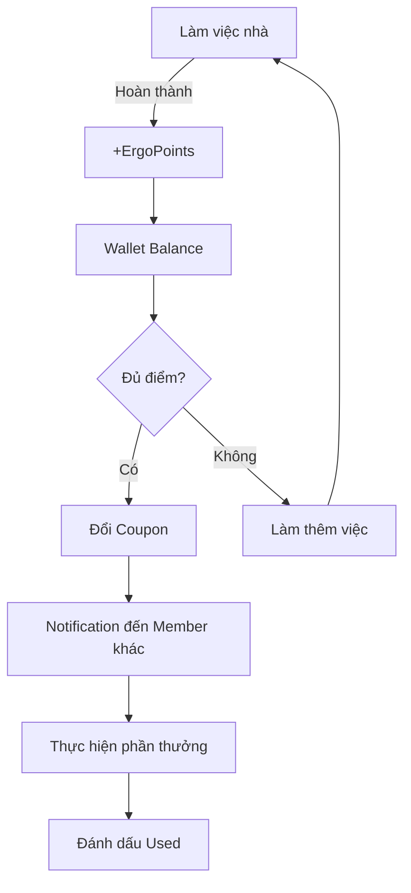
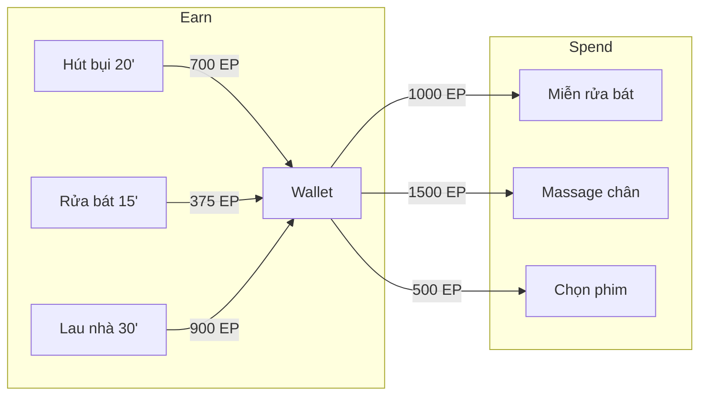

# Use Cases: Economy & Rewards

## Tổng quan Module
Hệ thống kinh tế trong game - người dùng tích lũy **ErgoPoints** từ việc làm việc nhà và đổi thành **Coupon phần thưởng** do các thành viên trong Nhà tự tạo.

---

## UC-12: Tạo Coupon phần thưởng (Create Reward)

| Thuộc tính | Giá trị |
|------------|---------|
| **ID** | UC-12 |
| **Tên** | Tạo Coupon phần thưởng |
| **Actor** | House Member |
| **Mô tả** | Người dùng tạo một phần thưởng mới cho cửa hàng của Nhà |

### Preconditions
- Người dùng đã đăng nhập
- Người dùng thuộc về một House

### Main Flow
1. Người dùng mở Reward Shop
2. Người dùng nhấn "Tạo Coupon mới"
3. Hệ thống hiển thị form tạo Coupon:
   - **Tên phần thưởng** (VD: "Massage chân 15 phút")
   - **Giá** (ErgoPoints)
   - **Icon** (chọn từ thư viện)
4. Người dùng nhập thông tin
5. Người dùng nhấn "Tạo"
6. Hệ thống lưu Reward vào database
7. Coupon xuất hiện trong Shop của Nhà

### Alternative Flows

#### AF-12.1: Validation thất bại
- **Điều kiện**: Tên rỗng hoặc giá <= 0
- **Xử lý**: Hiển thị error message, không cho tạo

### Postconditions
- Reward được tạo với `is_active = true`
- Tất cả thành viên trong Nhà có thể thấy và mua

### Business Rules
- BR-19: Giá tối thiểu: 100 points
- BR-20: Giá tối đa: 10,000 points
- BR-21: Tên coupon: 2-50 ký tự

### Ví dụ Coupon phổ biến

| Tên | Giá (EP) | Mô tả |
|-----|----------|-------|
| Miễn rửa bát 1 ngày | 1,000 | Được miễn rửa bát trong 1 ngày |
| Massage chân 15p | 1,500 | Nhận massage chân 15 phút |
| Chọn phim tối nay | 500 | Quyền chọn phim xem tối |
| Ăn sáng trên giường | 2,000 | Được phục vụ bữa sáng tại giường |

---

## UC-13: Đổi Coupon (Redeem Reward)

| Thuộc tính | Giá trị |
|------------|---------|
| **ID** | UC-13 |
| **Tên** | Đổi Coupon |
| **Actor** | House Member |
| **Mô tả** | Người dùng dùng điểm để đổi một phần thưởng |

### Preconditions
- Người dùng đã tích đủ điểm (`wallet_balance >= cost`)
- Reward đang `is_active = true`

### Main Flow
1. Người dùng mở Reward Shop
2. Hệ thống hiển thị danh sách Coupon với:
   - Tên, Icon, Giá
   - Status: "Mua được" / "Không đủ điểm"
3. Người dùng nhấn vào một Coupon "Mua được"
4. Hệ thống hiển thị dialog xác nhận:
   - "Bạn có chắc muốn đổi [Tên Coupon]?"
   - "Số điểm hiện tại: X EP → Còn lại: Y EP"
5. Người dùng xác nhận
6. Hệ thống thực hiện transaction:
   - Trừ `wallet_balance` của User
   - Tạo `redemption` record với status `pending`
7. Hệ thống gửi Push Notification cho các thành viên khác:
   - "[User] vừa đổi coupon: [Tên Coupon]!"
8. Hiển thị thông báo thành công

### Alternative Flows

#### AF-13.1: Không đủ điểm
- **Điều kiện**: `wallet_balance < cost`
- **Xử lý**: Nút Redeem bị disable, hiển thị "Cần thêm X điểm"

#### AF-13.2: Race condition
- **Điều kiện**: Balance giảm giữa lúc xem và confirm
- **Xử lý**: Backend reject transaction, hiển thị error

### Postconditions
- User's `wallet_balance` giảm
- Redemption record được tạo
- Các thành viên khác nhận notification

### Business Rules
- BR-22: Transaction phải atomic (dùng Firestore transaction)
- BR-23: Không thể đổi nếu balance < cost
- BR-24: Một coupon có thể được đổi nhiều lần (unlimited stock)

---

## UC-14: Xem Lịch sử (View History)

| Thuộc tính | Giá trị |
|------------|---------|
| **ID** | UC-14 |
| **Tên** | Xem Lịch sử |
| **Actor** | House Member |
| **Mô tả** | Người dùng xem lịch sử hoạt động và đổi thưởng |

### Preconditions
- Người dùng đã đăng nhập và thuộc Nhà

### Main Flow
1. Người dùng mở Profile hoặc History tab
2. Hệ thống hiển thị 2 tabs:
   - **Activities**: Lịch sử việc nhà đã làm
   - **Redemptions**: Lịch sử coupon đã đổi

#### Tab Activities
- Danh sách các `activity` records, sorted by timestamp DESC
- Mỗi item hiển thị:
  - Icon + Tên task
  - Thời lượng
  - Điểm nhận được
  - Thời gian (VD: "2 giờ trước")

#### Tab Redemptions  
- Danh sách các `redemption` records
- Mỗi item hiển thị:
  - Icon + Tên coupon
  - Số điểm đã dùng
  - Trạng thái: `Pending` / `Used`
  - Thời gian

### Postconditions
- Không có thay đổi data

---

## UC-15: Đánh dấu Coupon đã dùng (Use Coupon)

| Thuộc tính | Giá trị |
|------------|---------|
| **ID** | UC-15 |
| **Tên** | Đánh dấu Coupon đã dùng |
| **Actor** | House Member (người nhận coupon hoặc người đổi) |
| **Mô tả** | Đánh dấu một redemption đã được thực hiện |

### Main Flow
1. Người dùng vào History > Redemptions
2. Người dùng tìm coupon với status `Pending`
3. Người dùng nhấn "Đánh dấu đã dùng"
4. Hệ thống cập nhật `status = 'used'`
5. Hiển thị xác nhận

### Business Rules
- BR-25: Chỉ người đổi coupon hoặc member khác trong House mới có thể đánh dấu

---

## Bảng xếp hạng (Leaderboard)

Mặc dù không phải Use Case chính, Leaderboard là phần quan trọng của Economy:

### Cách tính Weekly Score
- Reset mỗi tuần (Monday 00:00 UTC)
- Tổng điểm = Sum of `points_earned` from `activities` trong tuần đó

### Hiển thị
- Avatar + Tên
- Điểm tuần
- Rank (1st, 2nd, 3rd với icons đặc biệt)

---

## Economy Flow Diagram



---

## Point Economy Summary



### Công thức tính điểm chi tiết

```
ErgoPoints = Duration(minutes) × METs × 10 × Bonus

Trong đó:
- Duration: Thời gian làm (phút)
- METs: Hệ số tiêu hao năng lượng của task
- Bonus: 
  + 1.0 (mặc định)
  + 1.1 nếu Magic Wipe > 95%
```

### Ví dụ thực tế

| Task | Thời gian | METs | Base Points | Bonus (95%) | Total |
|------|-----------|------|-------------|-------------|-------|
| Hút bụi | 20 phút | 3.5 | 700 | 770 | 770 |
| Rửa bát | 15 phút | 2.5 | 375 | 412 | 412 |
| Cọ toilet | 10 phút | 4.0 | 400 | 440 | 440 |
