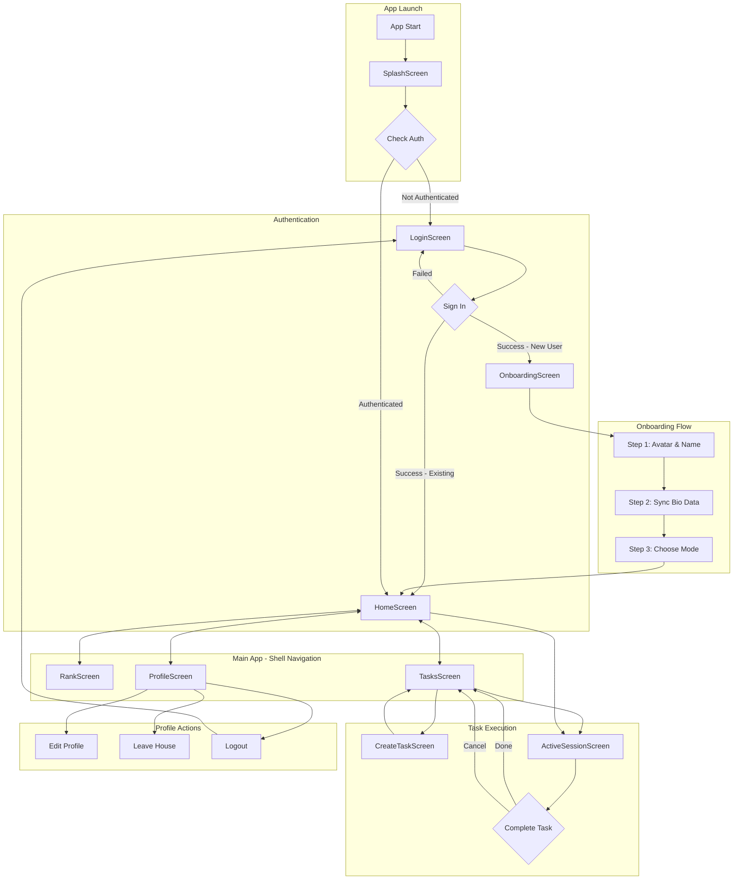

# ErgoLife App - Tổng Quan Màn Hình & Navigation

## 1. Giới Thiệu

ErgoLife là ứng dụng gamify việc nhà thành hoạt động thể dục, biến công việc gia đình thành cuộc thi thú vị giữa các thành viên trong gia đình.

## 2. Kiến Trúc Navigation

### 2.1 Stack Navigation
```
┌─────────────────────────────────────────────────────────────┐
│                      GoRouter                                │
├─────────────────────────────────────────────────────────────┤
│  Initial Route: /splash                                      │
│                                                              │
│  Top-Level Routes (Outside Shell):                           │
│  ├── /splash          → SplashScreen                        │
│  ├── /login           → LoginScreen                         │
│  ├── /onboarding      → OnboardingScreen                    │
│  ├── /create-task     → CreateTaskScreen (fullscreen)       │
│  └── /active-session  → ActiveSessionScreen (fullscreen)    │
│                                                              │
│  StatefulShellRoute (Bottom Navigation):                     │
│  └── MainShellScreen                                         │
│      ├── Branch 0: / (home)       → HomeScreen              │
│      ├── Branch 1: /rank          → RankScreen              │
│      ├── Branch 2: /tasks         → TasksScreen             │
│      └── Branch 3: /profile       → ProfileScreen           │
└─────────────────────────────────────────────────────────────┘
```

### 2.2 Bottom Navigation Tabs

| Index | Path | Screen | Icon | Label |
|-------|------|--------|------|-------|
| 0 | `/` | HomeScreen | `home` | Arena |
| 1 | `/rank` | RankScreen | `leaderboard` | Rank |
| 2 | `/tasks` | TasksScreen | `task_alt` | Tasks |
| 3 | `/profile` | ProfileScreen | `person` | Profile |

---

## 3. App Flow Diagram



---

## 4. Screen Summary

| # | Screen | Route | Mục Đích | API Calls |
|---|--------|-------|----------|-----------|
| 1 | SplashScreen | `/splash` | Kiểm tra auth, animation khởi động | `GET /auth/me` |
| 2 | LoginScreen | `/login` | Đăng nhập Google/Apple | `POST /auth/social-login` |
| 3 | OnboardingScreen | `/onboarding` | Setup người dùng mới (3 steps) | `PUT /users/me`, `POST /houses` |
| 4 | HomeScreen | `/` | Dashboard chính, quick tasks | `GET /auth/me`, `GET /activities/stats` |
| 5 | TasksScreen | `/tasks` | Danh sách nhiệm vụ | `GET /activities` |
| 6 | CreateTaskScreen | `/create-task` | Tạo task tùy chỉnh | (local only) |
| 7 | ActiveSessionScreen | `/active-session` | Thực hiện task, timer | `POST /activities` |
| 8 | RankScreen | `/rank` | Bảng xếp hạng trong house | `GET /activities/leaderboard` |
| 9 | ProfileScreen | `/profile` | Thông tin cá nhân, settings | `GET /auth/me`, `PUT /users/me` |
| 10 | MainShellScreen | (wrapper) | Bottom navigation container | - |

---

## 5. State Management Overview

### 5.1 Global BLoCs

| BLoC | Purpose | Key States |
|------|---------|------------|
| `AuthBloc` | Quản lý authentication | `AuthInitial`, `AuthLoading`, `AuthAuthenticated`, `AuthUnauthenticated`, `AuthError` |
| `UserBloc` | Thông tin user | (chưa implement) |
| `SessionBloc` | Phiên tập hiện tại | `SessionInactive`, `SessionActive`, `SessionPaused`, `SessionCompleted` |

### 5.2 Data Layer

```
lib/data/
├── models/
│   ├── auth_model.dart        # AuthCredentials, FirebaseUser
│   ├── session_model.dart     # Session, SessionStats
│   └── user_model.dart        # User, UserProfile
├── repositories/
│   ├── auth_repository.dart   # Authentication logic
│   ├── session_repository.dart # Session management
│   └── user_repository.dart   # User data access
└── services/
    ├── api_service.dart       # HTTP client wrapper
    ├── auth_service.dart      # Firebase Auth integration
    └── storage_service.dart   # Local storage (SharedPrefs)
```

---

## 6. Theme & Design System

### 6.1 Color Palette

| Color Name | Light Mode | Dark Mode | Usage |
|------------|------------|-----------|-------|
| Primary | `#FF6A00` | `#FF6A00` | CTA buttons, accents |
| Secondary | `#FF6A00` | `#FF6A00` | Highlights, points |
| Background | `#F8F7F5` | `#23170F` | Screen backgrounds |
| Surface | `#FFFFFF` | `#2C1F18` | Cards, containers |
| TextMain | `#181410` | `#FFFFFF` | Primary text |
| TextSub | `#667085` | `#98A2B3` | Secondary text |

### 6.2 Typography

- **Font Family**: Inter (Google Fonts)
- **Headings**: 28-32px, FontWeight 800-900
- **Body**: 14-16px, FontWeight 400-500
- **Captions**: 10-12px, FontWeight 600

---

## 7. Điểm Lưu Ý Quan Trọng

### 7.1 Hiện Trạng (Khung Sườn)
- ✅ UI layouts đã được xây dựng
- ✅ Navigation flow hoàn chỉnh
- ⚠️ Data còn hardcoded (mock data)
- ⚠️ API integration chưa hoàn thiện
- ⚠️ State management cần bổ sung thêm BLoCs

### 7.2 Cần Phát Triển Thêm
1. **UserBloc** - Quản lý thông tin user
2. **HouseBloc** - Quản lý House và members
3. **TaskBloc** - Quản lý danh sách tasks
4. **LeaderboardBloc** - Bảng xếp hạng
5. **RewardBloc** - Quản lý rewards/redemptions

---

## 8. Tài Liệu Chi Tiết

Xem chi tiết từng màn hình tại:
- [01 - Splash Screen](./01_splash_screen.md)
- [02 - Login Screen](./02_login_screen.md)
- [03 - Onboarding Screen](./03_onboarding_screen.md)
- [04 - Home Screen](./04_home_screen.md)
- [05 - Tasks Screen](./05_tasks_screen.md)
- [06 - Create Task Screen](./06_create_task_screen.md)
- [07 - Active Session Screen](./07_active_session_screen.md)
- [08 - Rank Screen](./08_rank_screen.md)
- [09 - Profile Screen](./09_profile_screen.md)
- [API Integration Matrix](./api_integration_matrix.md)
