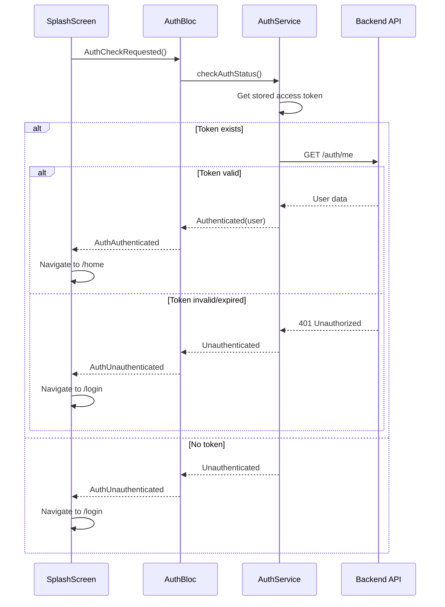

# SplashScreen - Màn Hình Khởi Động

## 1. Thông Tin Chung

| Property | Value |
|----------|-------|
| **File** | `lib/ui/screens/splash/splash_screen.dart` |
| **Route** | `/splash` |
| **Type** | `StatefulWidget` |
| **Dependencies** | `AuthBloc` (injected via constructor) |
| **Initial Route** | ✅ Yes |

---

## 2. Mục Đích

- Hiển thị logo và branding khi app khởi động
- Kiểm tra trạng thái authentication
- Điều hướng user đến màn hình phù hợp (Home hoặc Login)

---

## 3. UI Components

### 3.1 Widget Hierarchy

```
Scaffold
└── SafeArea
    └── Column
        ├── StatusBarRow (Time, Signal, WiFi, Battery icons)
        ├── Spacer
        ├── FadeTransition
        │   └── Column (Main Content)
        │       ├── Logo Container (Animated glow + pills)
        │       ├── "ErgoLife" Text (RichText)
        │       └── "MOVE. ACHIEVE. CONQUER." tagline
        ├── Spacer
        └── Loading Section
            ├── LinearProgressIndicator
            └── Version Text "v2.4.0"
```

### 3.2 Components Chi Tiết

#### 3.2.1 Status Bar Row (Visual)
- Hiển thị fake status bar để match design
- Time: "9:41"
- Icons: Signal, WiFi, Battery
- Color: `navyColor.withOpacity(0.4)`

#### 3.2.2 Logo Container
- Size: 128x128
- Glow effect: 140x140 circle với blur
- Pills layout:
  - 3 vertical pills (12×32, 12×48, 12×24)
  - 1 horizontal pill (48×12)
- Colors: Navy, Orange (primary), Navy 80%

#### 3.2.3 App Title
- "Ergo" - Navy color
- "Life" - Primary orange (`#FF6A00`)
- Font: Inter, 36px, weight 800

#### 3.2.4 Loading Indicator
- `LinearProgressIndicator` với value 0.66 (fake)
- Width: 160px
- Border radius: 3
- Active color: Primary orange

---

## 4. Animation

### 4.1 Fade Animation
```dart
AnimationController(
  vsync: this,
  duration: Duration(milliseconds: 2000),
)..repeat(reverse: true);

Tween<double>(begin: 0.6, end: 1.0)
  .animate(CurvedAnimation(curve: Curves.easeInOut));
```

- **Duration**: 2 seconds per cycle
- **Effect**: Logo và text fade 0.6 ↔ 1.0 opacity
- **Loop**: Vô hạn cho đến khi navigate away

---

## 5. Business Logic

### 5.1 Auth Check Flow



### 5.2 BlocListener Logic

```dart
BlocListener<AuthBloc, AuthState>(
  listener: (context, state) {
    if (state is AuthAuthenticated) {
      context.go(AppRouter.home);
    } else if (state is AuthUnauthenticated) {
      context.go(AppRouter.login);
    }
    // AuthInitial, AuthLoading → stay on splash
  },
)
```

---

## 6. API Integration

### 6.1 API Calls

| API | Method | When | Purpose |
|-----|--------|------|---------|
| `/auth/me` | GET | On `initState` | Verify token & get user info |

### 6.2 Response Handling

| Scenario | Response | Action |
|----------|----------|--------|
| Token valid | 200 + User data | Navigate to HomeScreen |
| Token expired | 401 Unauthorized | Navigate to LoginScreen |
| No token | - | Navigate to LoginScreen |
| Network error | Exception | Navigate to LoginScreen (or show error?) |

---

## 7. State Management

### 7.1 Local State

| Variable | Type | Purpose |
|----------|------|---------|
| `_controller` | `AnimationController` | Controls fade animation |
| `_fadeAnimation` | `Animation<double>` | Opacity animation value |

### 7.2 AuthBloc States

| State | Description | Navigation |
|-------|-------------|------------|
| `AuthInitial` | Initial state | Stay on splash |
| `AuthLoading` | Checking auth | Stay on splash |
| `AuthAuthenticated` | User logged in | → Home `/` |
| `AuthUnauthenticated` | No valid session | → Login `/login` |
| `AuthError` | Auth check failed | → Login `/login` |

---

## 8. Cải Tiến Đề Xuất

### 8.1 Hiện Tại (Issues)
- Progress indicator hardcoded (0.66) - không phản ánh actual loading
- Fake status bar icons - nên xóa vì system đã handle
- Version text hardcoded - nên lấy từ pubspec

### 8.2 Cần Implement

```dart
// 1. Real progress based on auth state
BlocBuilder<AuthBloc, AuthState>(
  builder: (context, state) => LinearProgressIndicator(
    value: state is AuthLoading ? null : 1.0, // Indeterminate khi loading
  ),
)

// 2. Dynamic version
PackageInfo.fromPlatform().then((info) {
  version = info.version;
});

// 3. Minimum splash duration
Future.delayed(Duration(seconds: 2), () {
  // Then check auth
});
```

### 8.3 Error Handling
Cần thêm xử lý cho trường hợp network error:

```dart
if (state is AuthError) {
  // Option 1: Retry
  // Option 2: Go to login with error message
  // Option 3: Show offline mode option
}
```

---

## 9. Screenshot Reference

```
┌────────────────────────────────────────┐
│  9:41                    󱟒 󰤨 󰂄       │
│                                        │
│                                        │
│              ╔═══════════╗             │
│              ║  ▐  ▐  ▐  ║             │
│              ║    ▐▐▐    ║             │
│              ╚═══════════╝             │
│               ErgoLife                 │
│        MOVE. ACHIEVE. CONQUER.         │
│                                        │
│                                        │
│            ████████████░░░             │
│               v2.4.0                   │
└────────────────────────────────────────┘
```
