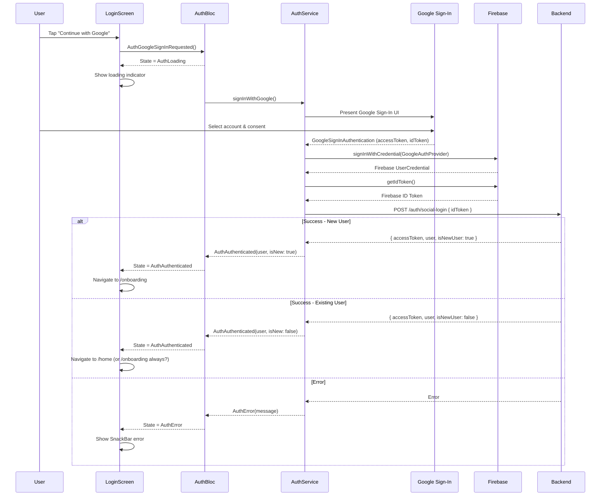

# LoginScreen - Màn Hình Đăng Nhập

## 1. Thông Tin Chung

| Property | Value |
|----------|-------|
| **File** | `lib/ui/screens/auth/login_screen.dart` |
| **Route** | `/login` |
| **Type** | `StatefulWidget` + `StatelessWidget` child |
| **Dependencies** | `AuthBloc` (injected via constructor) |

---

## 2. Mục Đích

- Cho phép user đăng nhập bằng Google hoặc Apple
- Xử lý authentication flow với Firebase
- Điều hướng đến Onboarding (new user) hoặc Home (existing user)

---

## 3. UI Components

### 3.1 Widget Hierarchy

```
Scaffold (backgroundColor: bgColor)
└── SafeArea
    └── BlocBuilder<AuthBloc>
        └── Column
            ├── Header Section
            │   └── Back Button (Circle container)
            ├── Spacer
            ├── Main Content (Expanded)
            │   └── Column
            │       ├── Logo Box (Rotated, with bolt icon)
            │       ├── "Let's Get Moving" title
            │       ├── Subtitle text
            │       ├── Loading Indicator (conditional)
            │       ├── Google Sign-In Button
            │       └── Apple Sign-In Button
            ├── Spacer
            └── Footer
                └── "New to ErgoLife? Create Account"
```

### 3.2 Components Chi Tiết

#### 3.2.1 Back Button
```dart
Container(
  width: 40, height: 40,
  decoration: BoxDecoration(
    color: surfaceColor,
    shape: BoxShape.circle,
    boxShadow: [...],
  ),
  child: Icon(Icons.arrow_back),
)
```

#### 3.2.2 Logo Box
- Size: 80×80
- Rotation: 3 degrees (`3 * 3.14159 / 180`)
- Background: Primary color (`#FF6A00`)
- Border: White 2px with opacity 0.5
- Icon: Bolt (⚡) 40px white
- Shadow: Primary color with opacity 0.2, blur 20

#### 3.2.3 Social Sign-In Button
```dart
Container(
  height: 80,
  decoration: BoxDecoration(
    borderRadius: BorderRadius.circular(16),
    color: surfaceColor,
  ),
  child: Row(
    children: [
      CircleAvatar (icon container),
      Text (button label),
      Icon (arrow_forward),
    ],
  ),
)
```

| Button | Icon | Label | Event |
|--------|------|-------|-------|
| Google | Google SVG logo | "Continue with Google" | `AuthGoogleSignInRequested` |
| Apple | Apple SVG logo | "Continue with Apple" | `AuthAppleSignInRequested` |

---

## 4. User Interactions

### 4.1 Available Actions

| Element | Action | Result |
|---------|--------|--------|
| Back Button | Tap | `context.pop()` - quay lại màn trước |
| Google Button | Tap | Trigger Google Sign-In flow |
| Apple Button | Tap | Trigger Apple Sign-In flow |
| "Create Account" | Tap | TODO: Navigate to register |

### 4.2 Loading State
Khi `AuthLoading`:
- Sign-in buttons ẩn đi
- `CircularProgressIndicator` hiển thị thay thế
- Back button và "Create Account" disabled

---

## 5. Authentication Flow

### 5.1 Google Sign-In Flow



### 5.2 Apple Sign-In Flow
Tương tự Google, nhưng sử dụng `SignInWithApple` package.

---

## 6. API Integration

### 6.1 API Endpoint

| API | Method | Payload | Purpose |
|-----|--------|---------|---------|
| `/auth/social-login` | POST | `{ idToken: string }` | Exchange Firebase token for app JWT |

### 6.2 Request/Response

**Request:**
```json
{
  "idToken": "eyJhbGciOiJSUzI1NiIsInR5cCI6..."
}
```

**Success Response (200):**
```json
{
  "success": true,
  "data": {
    "accessToken": "eyJhbGciOiJIUzI1NiIsInR5cCI6IkpXVCJ9...",
    "user": {
      "id": "550e8400-e29b-41d4-a716-446655440000",
      "firebaseUid": "abc123xyz",
      "email": "user@gmail.com",
      "displayName": "Minh Nguyen",
      "avatarId": 3,
      "houseId": null,
      "walletBalance": 0,
      "provider": "GOOGLE"
    },
    "isNewUser": false
  }
}
```

**Error Response (401):**
```json
{
  "success": false,
  "error": {
    "code": "INVALID_TOKEN",
    "message": "Firebase ID token is invalid or expired"
  }
}
```

---

## 7. State Management

### 7.1 BlocListener Logic

```dart
BlocListener<AuthBloc, AuthState>(
  listener: (context, state) {
    if (state is AuthAuthenticated) {
      context.go(AppRouter.onboarding);
    } else if (state is AuthError) {
      ScaffoldMessenger.of(context).showSnackBar(
        SnackBar(
          content: Text(state.message),
          backgroundColor: Colors.red,
        ),
      );
    }
  },
)
```

### 7.2 AuthBloc Events

| Event | Description |
|-------|-------------|
| `AuthGoogleSignInRequested` | User tapped Google button |
| `AuthAppleSignInRequested` | User tapped Apple button |

### 7.3 AuthBloc States Handled

| State | UI Effect |
|-------|-----------|
| `AuthLoading` | Show loading spinner, disable buttons |
| `AuthAuthenticated` | Navigate to onboarding |
| `AuthError` | Show error SnackBar |

---

## 8. Cải Tiến Đề Xuất

### 8.1 Issues Hiện Tại
- ⚠️ Luôn navigate đến `/onboarding` sau sign-in, cần check `isNewUser`
- ⚠️ "Create Account" chưa implement
- ⚠️ Back button behavior không rõ (pop về đâu từ login?)

### 8.2 Cần Implement

```dart
// 1. Check isNewUser để navigate đúng
if (state is AuthAuthenticated) {
  if (state.user.isNewUser || state.user.houseId == null) {
    context.go(AppRouter.onboarding);
  } else {
    context.go(AppRouter.home);
  }
}

// 2. Remove Back button hoặc implement properly
// Login là entry point, không nên có back

// 3. Implement biometric authentication (optional)
if (Platform.isIOS) {
  // Face ID / Touch ID
}
```

### 8.3 Error Handling Enhancement

```dart
// Different error types
switch (state.errorCode) {
  case 'USER_CANCELLED':
    // Silent - user cancelled, no error shown
    break;
  case 'NETWORK_ERROR':
    showSnackBar('No internet connection');
    break;
  case 'INVALID_TOKEN':
    showSnackBar('Authentication failed. Please try again.');
    break;
  default:
    showSnackBar('Something went wrong');
}
```

---

## 9. Theme Colors

| Element | Light Mode | Dark Mode |
|---------|------------|-----------|
| Background | `#F2F4F7` | `backgroundDark` |
| Surface (buttons) | White | `surfaceDark` |
| Primary text | `textMainLight` | White |
| Primary accent | `#FF6A00` | `#FF6A00` |

---

## 10. Accessibility

### 10.1 Current
- Button sizes: 80px height (good touch target)

### 10.2 Cần Thêm
- Semantic labels cho sign-in buttons
- Focus traversal order
- Screen reader support

```dart
Semantics(
  button: true,
  label: 'Sign in with Google',
  child: _buildSocialButton(...),
)
```
