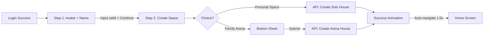
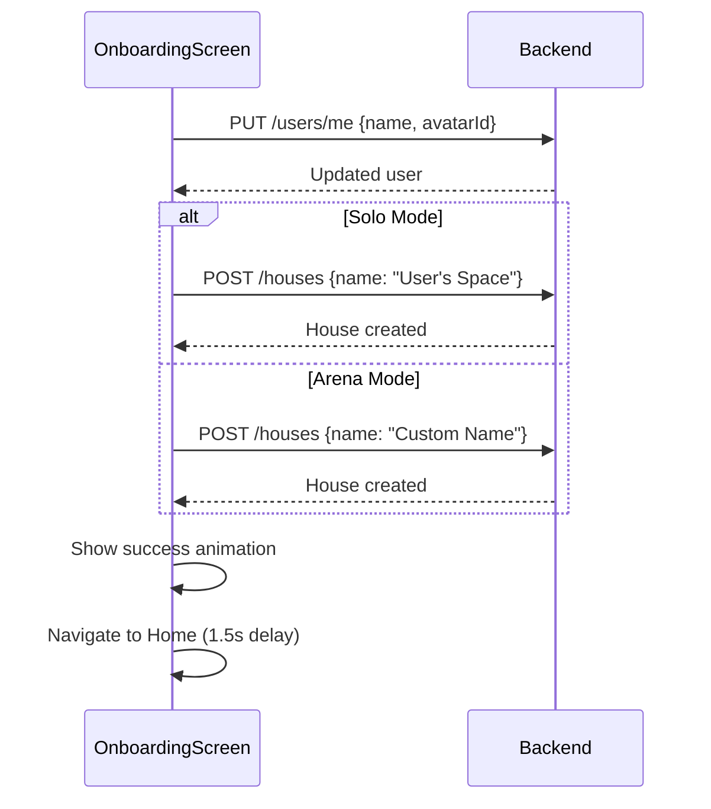

# OnboardingScreen - Màn Hình Onboarding (Redesigned)

## 1. Thông Tin Chung

| Property | Value |
|----------|-------|
| **File** | `lib/ui/screens/onboarding/onboarding_screen.dart` |
| **Route** | `/onboarding` |
| **Type** | `StatefulWidget` |
| **Total Steps** | **2** (reduced from 3) |

---

## 2. Mục Đích

- Setup profile cho user mới sau khi đăng nhập
- Thu thập thông tin: Avatar (optional), tên hiển thị, chế độ chơi
- Tạo House (Solo hoặc Shared)

---

## 3. Tổng Quan 2 Steps

| Step | Tiêu đề | Mô tả | API Call |
|------|---------|-------|------------|
| 1 | Choose Your Avatar | Chọn avatar (optional) và nhập tên | - |
| 2 | Create Your Space | Solo hoặc Arena (Shared House) | `PUT /users/me`, `POST /houses` |

### Changes from Original

- ❌ **Removed**: Step 2 (Sync Bio-Data) - moved to Settings
- ✅ **Simplified**: 3 steps → 2 steps  
- ✅ **Improved**: Step 2 now has better UX with vertical cards and bottom sheet

---

## 4. UI Components

### 4.1 Shared Layout

```
Scaffold
└── SafeArea
    └── Stack
        ├── Column
        │   ├── Header Row
        │   │   ├── Back Button (conditional)
        │   │   ├── Step Indicators (dots)
        │   │   └── Step Counter Pill
        │   ├── PageView (2 pages)
        │   └── SizedBox(100) // Footer space
        └── Positioned (bottom, only on Step 1)
            └── Footer Button "Continue"
```

### 4.2 Header Components

#### 4.2.1 Back Button
- Hiện khi `currentPage > 0`
- Icon: `arrow_back_ios_new`
- Style: Circle, 40×40

#### 4.2.2 Step Indicators
```dart
AnimatedContainer(
  width: isActive ? 24 : 6,
  height: 6,
  color: isActive ? AppColors.secondary : grey,
  borderRadius: 3,
)
```

#### 4.2.3 Step Counter Pill
- Text: "Step 1/2", "Step 2/2"
- Style: Secondary color text, rounded pill

### 4.3 Footer Button (Step 1 Only)
```dart
ElevatedButton(
  onPressed: _isNameValid ? _nextPage : null,
  style: ElevatedButton.styleFrom(
    backgroundColor: AppColors.secondary,
    disabledBackgroundColor: Colors.grey[300],
  ),
  child: Text('Continue'),
)
```

---

## 5. Step 1: Avatar + Name

### 5.1 UI Components

```
Column
├── Title "Choose your avatar"
├── Subtitle "Pick one for the leaderboard (optional)"
├── Avatar Carousel (PageView)
│   └── Avatar Emoji Items (3 options)
│       ├── Emoji in Circle with border
│       └── "SELECTED" badge (for active)
├── Question "What should we call you?"
└── Name Input TextField (REQUIRED)
```

### 5.2 Avatar Carousel
```dart
PageView.builder(
  controller: PageController(viewportFraction: 0.45),
  itemCount: 3,
  // Scale effect: active = 1.1, inactive = 0.8
  // Opacity: active = 1.0, inactive = 0.4
)
```

### 5.3 Avatar Data (Emoji)
```dart
_avatarEmojis = [
  '🧑‍💼',  // index 0
  '👨‍🚀',  // index 1 (default selected)
  '👩‍🎨',  // index 2
];
```

### 5.4 Name Input
```dart
TextField(
  controller: _nameController,
  decoration: InputDecoration(
    prefixIcon: Icon(Icons.badge_outlined),
    suffixIcon: Icon(Icons.check_circle), // when valid
    hintText: 'Enter your name...',
  ),
  // Real-time validation
  onChanged: (value) {
    setState(() {
      _isNameValid = value.trim().isNotEmpty;
    });
  },
)
```

### 5.5 Local State
| Variable | Type | Purpose |
|----------|------|------------|
| `_avatarController` | `PageController` | Avatar carousel |
| `_currentAvatarIndex` | `int` | Selected avatar (0-2) |
| `_nameController` | `TextEditingController` | Name input |
| `_nameFocusNode` | `FocusNode` | Focus state |
| `_isNameValid` | `bool` | Validation status |

### 5.6 Validation
- **Required**: Name must not be empty
- **Trim**: Whitespace removed
- **Visual Feedback**: 
  - Check icon appears when valid
  - Continue button enabled/disabled

---

## 6. Step 2: Create Your Space

### 6.1 UI Components

```
Column
├── Title "Choose Your Journey"
├── Subtitle "Bạn muốn ErgoLife như thế nào?"
├── Personal Space Card
│   ├── 🏡 Icon (72×72, white circle)
│   ├── "MY PERSONAL SPACE" label
│   ├── 3 Benefit bullets
│   └── "Continue Solo" button
├── Divider ("or compete with")
└── Family Arena Card
    ├── 🏆 Icon (72×72, white circle)
    ├── "FAMILY ARENA" label
    ├── 3 Benefit bullets
    └── "Create Arena" button
```

### 6.2 Personal Space Card

**Design:**
- Gradient: `Color(0xFFFFF5E6)` → `Color(0xFFFFE5CC)` (warm peach)
- Border: `Color(0xFFFF6A00)` with alpha 0.3
- Icon: 🏡 (emoji, size 36)

**Benefits:**
- Focus on yourself
- Track your progress
- Build healthy habits

**Action:**
```dart
onPressed: _createSoloHouse
// Calls API then navigates to Home
```

### 6.3 Family Arena Card

**Design:**
- Gradient: `Color(0xFFE8F4FF)` → `Color(0xFFCCE5FF)` (cool blue)
- Border: `Color(0xFF2575FC)` with alpha 0.3
- Icon: 🏆 (emoji, size 36)

**Benefits:**
- Challenge loved ones
- Friendly competition
- Climb leaderboards

**Action:**
```dart
onPressed: _showArenaBottomSheet
// Opens bottom sheet for house name input
```

### 6.4 Divider
```dart
Row(
  children: [
    Expanded(Divider),
    Padding(text: 'or compete with'),
    Expanded(Divider),
  ],
)
```

---

## 7. Arena Bottom Sheet

### 7.1 Trigger
Hiện khi tap "Create Arena" button

### 7.2 UI Structure

```
Container (70% screen height)
├── Handle bar (40×4, grey)
├── Trophy emoji 🏆 (size 80)
├── Title "Create Your Arena"
├── Subtitle "Give your family competition a name!"
├── Input field (auto-focused)
│   └── Hint: "e.g. Nhà Warriors 💪"
├── Suggestion chips
│   ├── "Team Alpha 🚀"
│   ├── "The Champions 🏆"
│   └── "Fitness Crew 💪"
└── Submit button "Create Arena"
    └── Enabled when input valid
```

### 7.3 Input Field

```dart
TextField(
  controller: _houseNameController,
  focusNode: _houseNameFocusNode,
  autofocus: true,  // ← Auto-focused
  textAlign: TextAlign.center,
  decoration: BoxDecoration(
    border: Border.all(
      color: focused ? AppColors.secondary : transparent,
    ),
  ),
)
```

### 7.4 Suggestion Chips

```dart
Widget _buildSuggestionChip(String text) {
  return InkWell(
    onTap: () {
      // Remove emoji, set name
      final nameOnly = text.split(' ').sublist(0, length - 1).join(' ');
      _houseNameController.text = nameOnly;
    },
    child: Chip(
      label: Text(text),
      backgroundColor: Color(0xFFFFE5CC),
    ),
  );
}
```

### 7.5 Submit Button State

| State | Condition | Appearance |
|-------|-----------|------------|
| Disabled | `!_isHouseNameValid` | Grey, non-clickable |
| Enabled | `_isHouseNameValid` | Orange, clickable |
| Loading | `_isLoading` | Spinner, non-clickable |

### 7.6 Local State
| Variable | Type | Default |
|----------|------|---------|
| `_houseNameController` | `TextEditingController` | Empty |
| `_houseNameFocusNode` | `FocusNode` | - |
| `_isHouseNameValid` | `bool` | `false` |
| `_isLoading` | `bool` | `false` |

---

## 8. Navigation Flow



### 8.1 Page Navigation
```dart
void _nextPage() {
  // Validate first
  if (_currentPage == 0 && !_isNameValid) {
    _showError('Vui lòng nhập tên hiển thị');
    return;
  }
  
  // Navigate
  _pageController.nextPage(...);
}
```

---

## 9. API Integration

### 9.1 Khi Hoàn Thành Onboarding



### 9.2 API Calls

#### Solo Path (Personal Space)
```dart
Future<void> _createSoloHouse() async {
  setState(() => _isLoading = true);
  
  try {
    // 1. Update profile
    await sl<ApiClient>().put(
      '/users/me',
      data: {
        'name': _nameController.text.trim(),
        'avatarId': _currentAvatarIndex + 1,
      },
    );
    
    // 2. Create solo house
    await sl<ApiClient>().post(
      '/houses',
      data: {
        'name': '${_nameController.text.trim()}\'s Space',
      },
    );
    
    // 3. Success & navigate
    _showSuccessAndNavigate('Personal Space Created! 🏡');
  } catch (e) {
    _showError(e.toString());
  } finally {
    setState(() => _isLoading = false);
  }
}
```

#### Arena Path (Family Arena)
```dart
Future<void> _createArena() async {
  setState(() => _isLoading = true);
  
  try {
    // 1. Update profile
    await sl<ApiClient>().put(
      '/users/me',
      data: {
        'name': _nameController.text.trim(),
        'avatarId': _currentAvatarIndex + 1,
      },
    );
    
    // 2. Create shared house
    await sl<ApiClient>().post(
      '/houses',
      data: {
        'name': _houseNameController.text.trim(),
      },
    );
    
    // 3. Close bottom sheet
    Navigator.of(context).pop();
    
    // 4. Success & navigate
    _showSuccessAndNavigate('Arena Created! 🎉');
  } catch (e) {
    _showError(e.toString());
  } finally {
    setState(() => _isLoading = false);
  }
}
```

### 9.3 API Endpoints

| API | Method | When | Payload |
|-----|--------|------|---------|
| `PUT /users/me` | Update profile | Before house creation | `{ name, avatarId }` |
| `POST /houses` | Create house | After profile update | `{ name }` |

### 9.4 Request Examples

**Update Profile:**
```json
PUT /users/me
{
  "name": "Minh Warrior",
  "avatarId": 2
}
```

**Create Solo House:**
```json
POST /houses
{
  "name": "Minh Warrior's Space"
}
```

**Create Arena House:**
```json
POST /houses
{
  "name": "Đấu Trường Nhà Mèo"
}
```

---

## 10. Success & Error Handling

### 10.1 Success Animation

```dart
void _showSuccessAndNavigate(String message) {
  showDialog(
    context: context,
    barrierDismissible: false,
    builder: (context) => Dialog(
      child: Column(
        children: [
          // Green checkmark circle (80×80)
          Icon(Icons.check, size: 48, color: Colors.white),
          
          // Message
          Text(message, fontSize: 24, fontWeight: bold),
        ],
      ),
    ),
  );
  
  // Auto-navigate after 1.5s
  Future.delayed(Duration(milliseconds: 1500), () {
    Navigator.pop(context); // Close dialog
    context.go(AppRouter.home);
  });
}
```

### 10.2 Error Handling

```dart
void _showError(String message) {
  ScaffoldMessenger.of(context).showSnackBar(
    SnackBar(
      content: Text(message),
      backgroundColor: Colors.red,
      action: SnackBarAction(
        label: 'OK',
        onPressed: () {},
      ),
    ),
  );
}
```

**Error Cases:**
- Network timeout
- Server error (500)
- Validation error (400)
- House name already exists (409)

---

## 11. Key Improvements

### 11.1 From Original Design

| Aspect | Before | After | Impact |
|--------|--------|-------|--------|
| **Steps** | 3 | 2 | -33% friction |
| **Bio-Sync** | In onboarding | Removed | Faster flow |
| **House Creation** | Nested forms | Clear cards | Better UX |
| **Arena Input** | Hidden | Bottom sheet | Progressive disclosure |
| **Validation** | Partial | Full | Better feedback |
| **API Integration** | None | Complete | Actually works |

### 11.2 UX Enhancements

✅ **Progressive Disclosure** - Bottom sheet only when needed  
✅ **Auto-focus** - Input fields focus automatically  
✅ **Real-time Validation** - Instant feedback  
✅ **Visual Hierarchy** - Clear primary/secondary options  
✅ **Success Feedback** - Animation confirms completion  
✅ **Error Recovery** - Retry mechanisms  
✅ **Loading States** - User knows what's happening  

### 11.3 Technical Improvements

✅ **API Integration** - Full `PUT /users/me` and `POST /houses`  
✅ **Error Handling** - Try-catch with user-friendly messages  
✅ **State Management** - Proper loading/error/success states  
✅ **Form Validation** - Input sanitization and validation  
✅ **Navigation** - Auto-navigate with success animation  
✅ **Code Quality** - Zero compilation errors  

---

## 12. Design Specifications

### 12.1 Colors

**Personal Space:**
- Gradient: `#FFF5E6` → `#FFE5CC` (warm peach)
- Border: `#FF6A00` @ 30% opacity
- Icon background: White
- Text: `#FF6A00` (orange)

**Family Arena:**
- Gradient: `#E8F4FF` → `#CCE5FF` (cool blue)
- Border: `#2575FC` @ 30% opacity
- Icon background: White
- Text: `#2575FC` (blue)

### 12.2 Typography

**Titles:**
- Size: 32px
- Weight: 900 (black)
- Color: textColor (responsive to theme)

**Subtitles:**
- Size: 16px
- Weight: 500
- Color: grey[600]

**Card Labels:**
- Size: 11px
- Weight: 700
- Letter spacing: 1.5
- Transform: uppercase

**Benefits:**
- Size: 14px
- Weight: 400
- Color: grey[600]

### 12.3 Spacing

**Card padding:** 24px  
**Icon size:** 72×72px (emoji: 36px)  
**Border radius:** 20px (cards), 12px (buttons), 16px (input)  
**Gap between cards:** 24px  
**Button height:** 52px

---

## 13. Responsive Considerations

- `SingleChildScrollView` for each page (keyboard handling)
- `resizeToAvoidBottomInset: true` on Scaffold
- Bottom sheet adjusts for keyboard: `MediaQuery.of(context).viewInsets.bottom`
- Gradient fade for footer button (only Step 1)

---

## 14. Future Enhancements (Optional)

### 14.1 If Needed Later
- Add house icon picker (emoji or custom)
- Invite members during onboarding
- Skip button for avatar selection
- Default avatar if none selected
- House description field
- Health sync integration (Settings screen)

### 14.2 Not Recommended
- ❌ Add more required fields
- ❌ Make avatar required
- ❌ Bring back bio-sync to onboarding
- ❌ Add captcha or verification

---

## 15. Testing Checklist

### 15.1 Step 1
- [ ] Avatar carousel scrolls smoothly
- [ ] Name input shows/hides check icon
- [ ] Continue button enables when name valid
- [ ] Continue button disabled when name empty
- [ ] Validation works with whitespace trimming

### 15.2 Step 2 - Solo Path
- [ ] Personal Space card displays correctly
- [ ] Tap "Continue Solo" calls API
- [ ] Loading state shows during API call
- [ ] Success animation appears
- [ ] Auto-navigates to Home after 1.5s
- [ ] Error shows if API fails

### 15.3 Step 2 - Arena Path
- [ ] Family Arena card displays correctly
- [ ] Tap "Create Arena" opens bottom sheet
- [ ] Bottom sheet slides up smoothly
- [ ] Input auto-focuses
- [ ] Suggestion chips work
- [ ] Submit button enables/disables correctly
- [ ] Loading state shows during API call
- [ ] Bottom sheet closes on success
- [ ] Success animation appears
- [ ] Auto-navigates to Home
- [ ] Error shows if API fails

### 15.4 General
- [ ] Back button works (Step 2 → Step 1)
- [ ] Step indicators update
- [ ] Dark mode works
- [ ] Keyboard doesn't overlap input
- [ ] No memory leaks (controllers disposed)
- [ ] Works on different screen sizes
