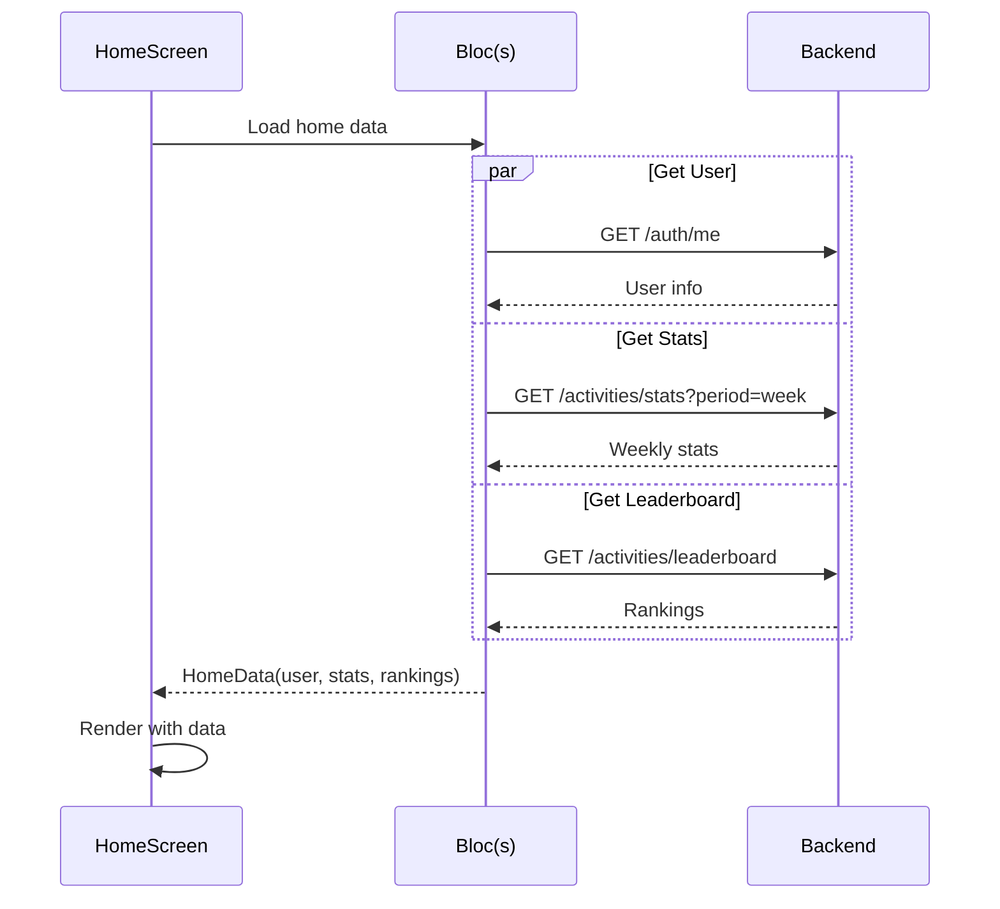

# HomeScreen - Màn Hình Arena

## 1. Thông Tin Chung

| Property | Value |
|----------|-------|
| **File** | `lib/ui/screens/home/home_screen.dart` |
| **Route** | `/` (home) |
| **Type** | `StatelessWidget` |
| **Tab Index** | 0 (Arena) |

---

## 2. Mục Đích

- Dashboard chính của app
- Hiển thị điểm hiện tại và progress
- Quick access đến các tasks phổ biến
- Entrance point vào active session

---

## 3. UI Components

### 3.1 Widget Hierarchy

```
Scaffold
├── Body: SafeArea
│   └── SingleChildScrollView (padding bottom 100)
│       └── Column
│           ├── HomeHeader
│           │   ├── Greeting + User name
│           │   └── Notification button
│           ├── ArenaSection
│           │   ├── Progress bars (You vs Rival)
│           │   └── Leaderboard link
│           └── QuickTasksSection
│               └── List of TaskCards
└── FloatingActionButton (Create Task)
```

### 3.2 External Widgets

Màn hình này sử dụng các widgets đã được tách riêng:

| Widget | File | Purpose |
|--------|------|---------|
| `HomeHeader` | `widgets/home_header.dart` | Header với greeting |
| `ArenaSection` | `widgets/arena_section.dart` | Competition progress |
| `QuickTasksSection` | `widgets/quick_tasks_section.dart` | Task grid |

---

## 4. HomeHeader Component

### 4.1 Structure
```dart
Row(
  children: [
    Column(
      children: [
        Text("Good morning,"), // Dynamic: morning/afternoon/evening
        Text(userName, style: bold),
      ],
    ),
    Spacer(),
    NotificationButton(),
  ],
)
```

### 4.2 Props
| Prop | Type | Purpose |
|------|------|---------|
| `isDark` | `bool` | Theme mode |
| `userName` | `String` | User display name |
| `onNotificationTap` | `VoidCallback` | Notification action |

### 4.3 Data Cần Fetch
- `userName` từ `GET /auth/me` → `user.displayName`
- Notification count (chưa implement)

---

## 5. ArenaSection Component

### 5.1 Structure
```dart
Container(
  decoration: gradient + borderRadius,
  child: Column(
    children: [
      TitleRow("Your Arena", LeaderboardLink),
      ProgressSection(
        userProgress: userPoints/totalPoints,
        rivalProgress: rivalPoints/totalPoints,
      ),
      ScoreDisplay(userPoints, rivalPoints),
    ],
  ),
)
```

### 5.2 Props
| Prop | Type | Purpose |
|------|------|---------|
| `isDark` | `bool` | Theme mode |
| `userPoints` | `int` | Current user's weekly points |
| `rivalPoints` | `int` | Top rival's weekly points |
| `totalPoints` | `int` | Goal for comparison visual |
| `onLeaderboardTap` | `VoidCallback` | Navigate to Rank |

### 5.3 Hardcoded Data (Current)
```dart
ArenaSection(
  userPoints: 1240,
  rivalPoints: 1100,
  totalPoints: 1600,
)
```

### 5.4 Data Cần Fetch
Từ `GET /activities/leaderboard`:
- `userPoints` = current user's `weeklyPoints`
- `rivalPoints` = 1st place (if not user) or 2nd place
- `totalPoints` = max(userPoints, rivalPoints) + buffer

---

## 6. QuickTasksSection Component

### 6.1 Structure
```dart
Column(
  children: [
    Row(
      children: [
        Text("Quick Tasks"),
        Badge("X Active"),
        Spacer(),
        IconButton(⋮) → Navigate to Manage Tasks
      ],
    ),
    GridView(
      children: tasks.map((t) => TaskCard(t)),
    ),
  ],
)
```

### 6.2 Quick Tasks Behavior

**Display Logic:**
- Shows **ALL non-hidden tasks** (no limit)
- Sorted by `sortOrder` (user-controlled via drag & drop)
- User has full control via "Manage Tasks" screen

**Quick Tasks Management:**
- Tap ⋮ icon → Opens "Manage Tasks" screen
- User can:
  - Drag & drop to reorder tasks
  - Toggle visibility (hide/show tasks)
  - Save changes via batch API update

### 6.3 TaskCard Structure
```dart
Container(
  decoration: borderRadius + shadow,
  child: Column(
    children: [
      Row(
        IconBox(icon, color),
        Badge(EP points),
      ),
      Text(title, subtitle),
      DurationBadge(duration),
    ],
  ),
)
```

### 6.4 TaskData Model
```dart
class TaskData {
  final IconData icon;
  final Color iconColor;
  final String title;
  final String subtitle;
  final String duration;
  final int ep; // Energy Points
}
```

### 6.5 Task Data Source

**From API:** `GET /tasks`
- Tasks fetched from backend
- Filtered: `isHidden = false`
- Sorted by: `sortOrder` (ascending)
- Converted to `TaskModel` then `TaskData`

---

## 7. Floating Action Button

### 7.1 Structure
```dart
Container(
  width: 56, height: 56,
  decoration: BoxDecoration(
    color: AppColors.secondary,
    shape: BoxShape.circle,
    boxShadow: [...],
  ),
  child: IconButton(
    icon: Icon(Icons.add),
    onPressed: () => context.push(AppRouter.createTask),
  ),
)
```

### 7.2 Action
Navigate to `/create-task` để tạo task mới

---

## 8. User Interactions

| Element | Action | Navigation |
|---------|--------|------------|
| Notification button | Tap | TODO: Notification screen |
| "Leaderboard" link | Tap | Navigate to Rank tab |
| Quick Task item | Tap | Navigate to `/active-session` |
| FAB (+) | Tap | Navigate to `/create-task` |

---

## 9. API Integration

### 9.1 APIs Cần Gọi

| API | When | Purpose |
|-----|------|---------|
| `GET /auth/me` | On screen load | Get user info |
| `GET /activities/stats` | On screen load | Get weekly stats |
| `GET /activities/leaderboard` | On screen load | Get ranking data |

### 9.2 Data Flow



### 9.3 Expected Data Mapping

| UI Element | API Source | Field |
|------------|------------|-------|
| User name | `/auth/me` | `displayName` |
| User points | `/activities/stats` | `totalPoints` |
| Rival points | `/activities/leaderboard` | `rankings[X].weeklyPoints` |
| Quick tasks | (predefined list) | - |

---

## 10. State Management

### 10.1 Cần Implement BLoCs

| BLoC | Events | States |
|------|--------|--------|
| `HomeBloc` | `LoadHomeData` | `HomeLoading`, `HomeLoaded`, `HomeError` |

### 10.2 HomeState Structure
```dart
class HomeLoaded extends HomeState {
  final User user;
  final WeeklyStats stats;
  final List<LeaderboardEntry> rankings;
  final List<TaskData> quickTasks;
}
```

---

## 11. Cải Tiến Đã Thực Hiện

### 11.1 Completed Features
- ✅ Data from API (not hardcoded)
- ✅ Loading states implemented
- ✅ Error handling with retry
- ✅ Quick tasks from backend with full user control

### 11.2 Quick Tasks Management (NEW)
**Feature:** Desktop task customization screen
- Access via ⋮ icon on Quick Tasks header
- Drag & drop reordering (updates `sortOrder`)
- Toggle hide/show (updates `isHidden`)
- Batch save to API
- User has full control over what displays on home

**User Control:**
- Choose which tasks to show/hide
- Arrange tasks in preferred order
- No arbitrary limits on task count

### 11.3 Pull to Refresh
```dart
RefreshIndicator(
  onRefresh: () => context.read<HomeBloc>().add(LoadHomeData()),
  child: SingleChildScrollView(...),
)
```

### 11.4 Greeting Logic
```dart
String getGreeting() {
  final hour = DateTime.now().hour;
  if (hour < 12) return 'Good morning';
  if (hour < 17) return 'Good afternoon';
  return 'Good evening';
}
```

---

## 12. Responsive Considerations

- `SingleChildScrollView` với bottom padding 100 cho bottom nav
- Cards responsive to screen width
- Text scaling
