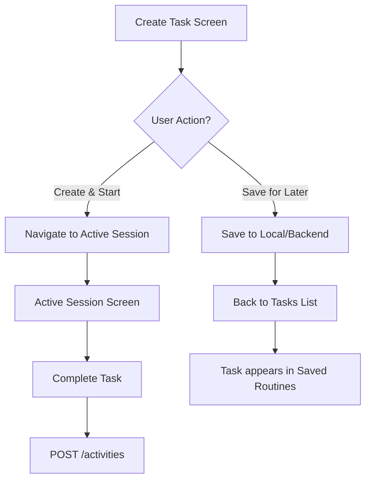

# CreateTaskScreen - Màn Hình Tạo Nhiệm Vụ Mới

## 1. Thông Tin Chung

| Property | Value |
|----------|-------|
| **File** | `lib/ui/screens/tasks/create_task_screen.dart` |
| **Route** | `/create-task` |
| **Type** | `StatefulWidget` |
| **Navigation** | Fullscreen dialog (from Tasks or Home) |

---

## 2. Mục Đích

- Cho phép user tạo custom task/exercise
- Define exercise name, real-life task, duration, reward points
- Chọn icon đại diện cho task
- Save task để sử dụng sau

---

## 3. UI Components

### 3.1 Widget Hierarchy

```
Scaffold
└── SafeArea
    └── Stack
        ├── Column
        │   ├── Header (Back, Title)
        │   └── Expanded ScrollView
        │       └── Form Column
        │           ├── Hero Text "Create your exercise. 🏋️"
        │           ├── Subtitle
        │           ├── TextField: EXERCISE NAME
        │           ├── TextField: REAL LIFE TASK
        │           ├── Row
        │           │   ├── TextField: DURATION (min)
        │           │   └── TextField: REWARD (EP)
        │           └── Icon Selector (horizontal list)
        └── Positioned (bottom)
            └── Create Button (Gradient fade background)
```

---

## 4. Header Section

### 4.1 Structure
```dart
Row(
  mainAxisAlignment: MainAxisAlignment.spaceBetween,
  children: [
    BackButton (circle, 40×40),
    Text("New Custom Task"),
    SizedBox(width: 40), // Balance
  ],
)
```

### 4.2 Back Button Action
```dart
onPressed: () => context.pop()
```

---

## 5. Form Fields

### 5.1 Controllers

| Controller | Type | Purpose |
|------------|------|---------|
| `_nameController` | `TextEditingController` | Exercise name input |
| `_descController` | `TextEditingController` | Real-life task description |
| `_durationController` | `TextEditingController` | Duration in minutes |
| `_rewardController` | `TextEditingController` | Reward points (EP) |

### 5.2 Exercise Name Field
```dart
TextField(
  controller: _nameController,
  decoration: InputDecoration(
    hintText: 'e.g. Vacuum Lunges',
    prefixIcon: Icon(Icons.fitness_center),
  ),
)
```

### 5.3 Real Life Task Field
```dart
TextField(
  controller: _descController,
  decoration: InputDecoration(
    hintText: 'e.g. Vacuuming living room',
    prefixIcon: Icon(Icons.cleaning_services),
  ),
)
```

### 5.4 Duration Field
```dart
TextField(
  controller: _durationController,
  keyboardType: TextInputType.number,
  style: TextStyle(fontSize: 24, fontWeight: bold),
  decoration: InputDecoration(
    hintText: '20',
    suffixText: 'min',
  ),
)
```

### 5.5 Reward Field
```dart
TextField(
  controller: _rewardController,
  keyboardType: TextInputType.number,
  style: TextStyle(fontSize: 24, fontWeight: bold, color: orange),
  decoration: InputDecoration(
    hintText: '150',
    suffixText: 'EP',
  ),
)
```

---

## 6. Icon Selector

### 6.1 Available Icons

```dart
_availableIcons = [
  Icons.fitness_center,      // Default selected
  Icons.local_laundry_service,
  Icons.shopping_cart,
  Icons.cleaning_services,
  Icons.add_circle,
  Icons.directions_run,
  Icons.self_improvement,
  Icons.water_drop,
  Icons.kitchen,
];
```

### 6.2 Icon Item Component
```dart
GestureDetector(
  onTap: () => setState(() => _selectedIcon = icon),
  child: AnimatedContainer(
    width: 64, height: 64,
    decoration: BoxDecoration(
      color: isSelected ? primary : surface,
      borderRadius: 16,
      border: Border.all(color: isSelected ? primary : transparent),
      boxShadow: isSelected ? [...] : [],
    ),
    child: Icon(icon, color: isSelected ? white : grey),
  ),
)
```

### 6.3 Local State

| Variable | Type | Default |
|----------|------|---------|
| `_selectedIcon` | `IconData` | `Icons.fitness_center` |

---

## 7. Create Button

### 7.1 Structure
```dart
Positioned(
  left: 0, right: 0, bottom: 0,
  child: Container(
    padding: EdgeInsets.all(24),
    decoration: BoxDecoration(
      gradient: LinearGradient(
        colors: [bgColor, bgColor.withOpacity(0.95), transparent],
      ),
    ),
    child: ElevatedButton(
      onPressed: _createTask,
      style: ElevatedButton.styleFrom(
        backgroundColor: AppColors.secondary,
        height: 56,
        borderRadius: 30,
      ),
      child: Row(
        mainAxisAlignment: MainAxisAlignment.center,
        children: [
          Icon(Icons.add_circle),
          SizedBox(width: 8),
          Text("Create Exercise"),
        ],
      ),
    ),
  ),
)
```

### 7.2 Current Behavior
```dart
onPressed: () {
  // TODO: Create logic
  context.pop();
}
```

---

## 8. User Interactions

| Element | Action | Effect |
|---------|--------|--------|
| Back button | Tap | `context.pop()` - quay lại màn trước |
| Name field | Input | Update `_nameController` |
| Task field | Input | Update `_descController` |
| Duration field | Input | Update `_durationController` (number) |
| Reward field | Input | Update `_rewardController` (number) |
| Icon item | Tap | Update `_selectedIcon` |
| Create button | Tap | Create task & pop |

---

## 9. API Integration

### 9.1 Hiện Tại
Chưa có API call - task chỉ là local.

### 9.2 Proposed API

**Option A: Save as Custom Task (Backend)**
```http
POST /tasks/custom
{
  "exerciseName": "Vacuum Lunges",
  "taskDescription": "Vacuuming living room",
  "durationMinutes": 20,
  "estimatedPoints": 150,
  "icon": "fitness_center"
}
```

**Option B: Start Session Directly**
Không save, chỉ navigate đến ActiveSession với data:
```dart
context.push(
  AppRouter.activeSession,
  extra: CustomTask(
    name: _nameController.text,
    description: _descController.text,
    duration: int.parse(_durationController.text),
    points: int.parse(_rewardController.text),
    icon: _selectedIcon,
  ),
);
```

### 9.3 Recommended Flow



---

## 10. State Management

### 10.1 Local State (Current)

```dart
// All managed within widget state
final _nameController = TextEditingController();
final _descController = TextEditingController();
final _durationController = TextEditingController();
final _rewardController = TextEditingController();
IconData _selectedIcon = Icons.fitness_center;
```

### 10.2 Proposed BLoC Integration

```dart
// TaskBloc
class TaskBloc extends Bloc<TaskEvent, TaskState> {
  on<CreateCustomTask>((event, emit) async {
    emit(TaskCreating());
    try {
      final task = await taskRepo.createCustomTask(event.task);
      emit(TaskCreated(task));
    } catch (e) {
      emit(TaskError(e.message));
    }
  });
}
```

---

## 11. Validation

### 11.1 Required Fields

| Field | Required | Validation |
|-------|----------|------------|
| Exercise Name | ✅ | Non-empty, 2-50 chars |
| Real Life Task | ❌ | Optional |
| Duration | ✅ | Number, 1-120 minutes |
| Reward | ✅ | Number, 1-999 points |
| Icon | ✅ | Has default value |

### 11.2 Implementation Needed

```dart
bool _validateForm() {
  if (_nameController.text.trim().isEmpty) {
    showError('Please enter exercise name');
    return false;
  }
  
  final duration = int.tryParse(_durationController.text);
  if (duration == null || duration < 1 || duration > 120) {
    showError('Duration must be 1-120 minutes');
    return false;
  }
  
  final reward = int.tryParse(_rewardController.text);
  if (reward == null || reward < 1 || reward > 999) {
    showError('Reward must be 1-999 EP');
    return false;
  }
  
  return true;
}

void _createTask() {
  if (!_validateForm()) return;
  
  // Create logic...
  context.pop();
}
```

---

## 12. Cải Tiến Đề Xuất

### 12.1 Issues Hiện Tại
- ⚠️ No validation
- ⚠️ Create button chỉ pop, không save
- ⚠️ No loading state
- ⚠️ No METs value selection (for accurate points calculation)

### 12.2 Add METs Input

Points should be calculated, not user-entered:
```dart
// Add intensity/METs dropdown
DropdownButton<double>(
  value: _selectedMets,
  items: [
    DropdownMenuItem(value: 2.0, child: Text('Light (2.0 METs)')),
    DropdownMenuItem(value: 3.5, child: Text('Moderate (3.5 METs)')),
    DropdownMenuItem(value: 5.0, child: Text('Vigorous (5.0 METs)')),
  ],
)

// Auto-calculate points
int get estimatedPoints {
  final duration = int.tryParse(_durationController.text) ?? 0;
  return (duration * _selectedMets * 10).floor();
}
```

### 12.3 Save Options

Add option to:
1. **Start Now** - Navigate to Active Session
2. **Save for Later** - Add to Saved Routines
3. **Both** - Save and start

```dart
Row(
  children: [
    Expanded(
      child: OutlinedButton(
        onPressed: _saveForLater,
        child: Text('Save'),
      ),
    ),
    SizedBox(width: 16),
    Expanded(
      child: ElevatedButton(
        onPressed: _createAndStart,
        child: Text('Start Now'),
      ),
    ),
  ],
)
```

---

## 13. Data Model

### 13.1 CustomTask Model

```dart
class CustomTask {
  final String? id;
  final String exerciseName;
  final String? taskDescription;
  final int durationMinutes;
  final int estimatedPoints;
  final double metsValue;
  final String iconName;
  final DateTime createdAt;
  final bool isFavorite;
}
```

### 13.2 Icon Mapping

```dart
const iconMapping = {
  'fitness_center': Icons.fitness_center,
  'laundry': Icons.local_laundry_service,
  'shopping': Icons.shopping_cart,
  'cleaning': Icons.cleaning_services,
  // ...
};

String getIconName(IconData icon) {
  return iconMapping.entries
    .firstWhere((e) => e.value == icon)
    .key;
}
```
