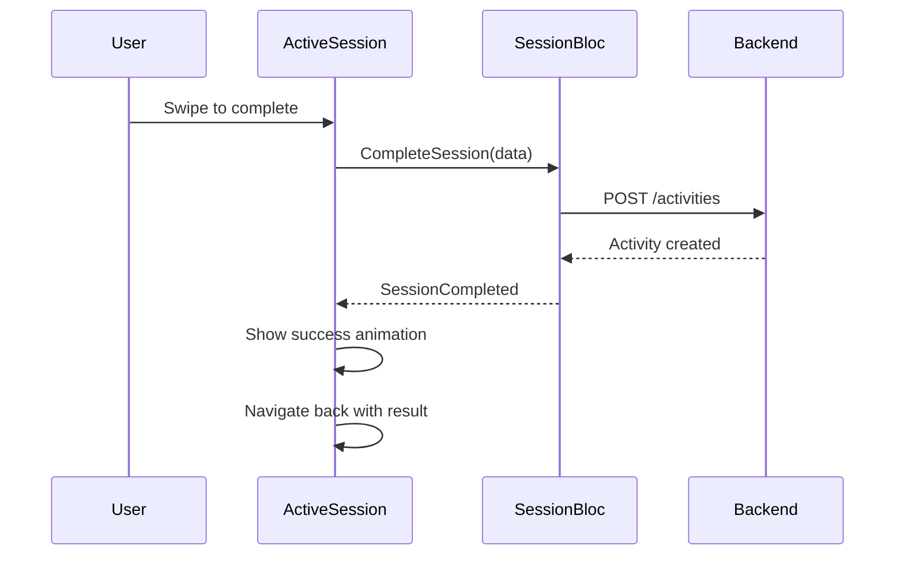

# ActiveSessionScreen - Màn Hình Phiên Tập

## 1. Thông Tin Chung

| Property | Value |
|----------|-------|
| **File** | `lib/ui/screens/tasks/active_session_screen.dart` |
| **Route** | `/active-session` |
| **Type** | `StatelessWidget` |
| **Navigation** | Fullscreen dialog |

---

## 2. Mục Đích

- Hiển thị phiên tập đang hoạt động
- Timer đếm thời gian thực hiện
- Theo dõi calories và điểm tích lũy
- Gesture-based completion (swipe to end)

---

## 3. UI Components

### 3.1 Widget Hierarchy

```
Scaffold
└── Column
    ├── Expanded (flex: 55) - Top Section
    │   └── Container (rounded bottom corners)
    │       └── Stack
    │           ├── Background Image
    │           ├── Top Gradient Overlay
    │           └── Header Row
    │               ├── Close Button (GlassButton)
    │               ├── Title + Recording Indicator
    │               └── More Button (GlassButton)
    │
    └── Expanded (flex: 45) - Bottom Section
        └── Padding
            └── Column
                ├── Timer Section
                │   ├── Time Display "12:45"
                │   └── Target Time "TARGET 20:00"
                ├── Stats Row
                │   ├── Calories (184)
                │   ├── Divider
                │   └── Points (320)
                ├── Task Info
                │   ├── Title "Legs & Glutes: Vacuuming"
                │   └── Subtitle "MODERATE • ROOM 1"
                └── SwipeToEndButton
```

---

## 4. Top Section (55%)

### 4.1 Container Styling
```dart
Container(
  decoration: BoxDecoration(
    color: Colors.black,
    borderRadius: BorderRadius.only(
      bottomLeft: Radius.circular(48),
      bottomRight: Radius.circular(48),
    ),
    boxShadow: [
      BoxShadow(
        color: Colors.black.withValues(alpha: 0.1),
        blurRadius: 40,
        offset: Offset(0, 20),
      ),
    ],
  ),
  clipBehavior: Clip.antiAlias,
)
```

### 4.2 Background Image
```dart
Image.network(
  "https://lh3.googleusercontent.com/aida-public/...",
  fit: BoxFit.cover,
)
```

### 4.3 Top Gradient
- Purpose: Làm header text dễ đọc hơn
- Colors: white 0.8 → white 0.3 → transparent
- Height: 128

### 4.4 Header Components

| Element | Widget | Action |
|---------|--------|--------|
| Close button | `GlassButton(arrow_down)` | `Navigator.pop()` |
| Title | "Active Session" + `PulsingRecordIndicator` | - |
| More button | `GlassButton(more_horiz)` | TODO: Options menu |

### 4.5 PulsingRecordIndicator

```dart
// Animation: Repeating ping effect
AnimationController(duration: 2s)..repeat()

ScaleTransition(1.0 → 2.0) +
FadeTransition(0.75 → 0.0) +
Center solid circle
```

- Size: 10×10
- Color: `AppColors.secondary` (orange)
- Effect: Pulsing ping ripple around solid dot

---

## 5. Bottom Section (45%)

### 5.1 Timer Section

```dart
Column(
  children: [
    Text(
      '12:45', // Hardcoded
      style: TextStyle(
        fontSize: 88,
        fontWeight: FontWeight.w900,
        letterSpacing: -4,
        fontFeatures: [FontFeature.tabularFigures()],
      ),
    ),
    Row(
      children: [
        Icon(Icons.timer, color: orange),
        Text('TARGET 20:00'),
      ],
    ),
  ],
)
```

### 5.2 Stats Row

| Stat | Icon | Value | Label | Color |
|------|------|-------|-------|-------|
| Calories | local_fire_department | 184 | CALORIES | Orange |
| Points | bolt | 320 | POINTS | Amber |

```dart
// SessionStatItem widget (external)
SessionStatItem(
  icon: Icons.local_fire_department,
  value: '184',
  label: 'CALORIES',
  color: AppColors.secondary,
  isDark: isDark,
)
```

### 5.3 Task Info

```dart
Column(
  children: [
    Text(
      'Legs & Glutes: Vacuuming',
      style: TextStyle(fontSize: 24, fontWeight: FontWeight.w800),
    ),
    Text(
      'MODERATE • ROOM 1',
      style: TextStyle(fontSize: 12, letterSpacing: 1),
    ),
  ],
)
```

### 5.4 SwipeToEndButton

```dart
// External widget
SwipeToEndButton(
  isDark: isDark,
  onComplete: () => Navigator.pop(context),
)
```

- Gesture: Swipe right to complete
- Animation: Slider track effect
- Action: Complete session and pop

---

## 6. External Widgets

| Widget | Path | Purpose |
|--------|------|---------|
| `GlassButton` | `ui/common/widgets/glass_button.dart` | Frosted glass icon button |
| `SwipeToEndButton` | `ui/screens/tasks/widgets/swipe_to_end_button.dart` | Swipe gesture completion |
| `SessionStatItem` | `ui/screens/tasks/widgets/session_stat_item.dart` | Stats display item |

---

## 7. User Interactions

| Element | Action | Effect |
|---------|--------|--------|
| Close button (↓) | Tap | `Navigator.pop()` - cancel session? |
| More button (...) | Tap | TODO: Show options (pause, settings) |
| Swipe button | Swipe right | Complete session |

---

## 8. API Integration

### 8.1 When to Call API

API call should happen when session completes:



### 8.2 POST /activities Payload

```json
{
  "taskName": "Legs & Glutes: Vacuuming",
  "durationSeconds": 765,  // Actual elapsed time (12:45)
  "metsValue": 3.5,
  "magicWipePercentage": 95
}
```

### 8.3 Expected Response

```json
{
  "success": true,
  "data": {
    "activity": {
      "id": "...",
      "taskName": "Legs & Glutes: Vacuuming",
      "durationSeconds": 765,
      "pointsEarned": 445,
      "bonusMultiplier": 1.1,
      "completedAt": "2025-12-20T10:30:00.000Z"
    },
    "wallet": {
      "previousBalance": 2500,
      "pointsEarned": 445,
      "newBalance": 2945
    }
  }
}
```

---

## 9. State Management

### 9.1 Cần Implement

```dart
// SessionBloc
class SessionBloc extends Bloc<SessionEvent, SessionState> {
  Timer? _timer;
  int _elapsedSeconds = 0;
  
  on<StartSession>((event, emit) {
    _elapsedSeconds = 0;
    _timer = Timer.periodic(Duration(seconds: 1), (_) {
      add(TimerTick());
    });
    emit(SessionActive(task: event.task, elapsed: 0));
  });
  
  on<TimerTick>((event, emit) {
    _elapsedSeconds++;
    emit(SessionActive(
      task: state.task,
      elapsed: _elapsedSeconds,
      calories: _calculateCalories(),
      points: _calculatePoints(),
    ));
  });
  
  on<CompleteSession>((event, emit) async {
    _timer?.cancel();
    emit(SessionCompleting());
    
    final result = await activityRepo.createActivity(
      taskName: state.task.name,
      durationSeconds: _elapsedSeconds,
      metsValue: state.task.metsValue,
      magicWipePercentage: event.wipePercentage,
    );
    
    emit(SessionCompleted(result));
  });
}
```

### 9.2 SessionState

```dart
abstract class SessionState {}

class SessionInactive extends SessionState {}

class SessionActive extends SessionState {
  final Task task;
  final int elapsedSeconds;
  final int calories;
  final int points;
  final int targetSeconds;
}

class SessionCompleting extends SessionState {}

class SessionCompleted extends SessionState {
  final ActivityResult result;
}
```

---

## 10. Cải Tiến Đề Xuất

### 10.1 Issues Hiện Tại
- ⚠️ All data hardcoded (timer, stats, task info)
- ⚠️ Timer không hoạt động (không đếm)
- ⚠️ No state management
- ⚠️ Close button = pop without saving
- ⚠️ Missing pause functionality
- ⚠️ No confirmation before closing

### 10.2 Real Timer Implementation

```dart
class ActiveSessionScreen extends StatefulWidget {
  final Task task;
  
  const ActiveSessionScreen({required this.task});
  
  @override
  State<ActiveSessionScreen> createState() => _ActiveSessionScreenState();
}

class _ActiveSessionScreenState extends State<ActiveSessionScreen> {
  late Timer _timer;
  int _elapsedSeconds = 0;
  
  @override
  void initState() {
    super.initState();
    _timer = Timer.periodic(Duration(seconds: 1), (timer) {
      setState(() => _elapsedSeconds++);
    });
  }
  
  @override
  void dispose() {
    _timer.cancel();
    super.dispose();
  }
  
  String get formattedTime {
    final minutes = _elapsedSeconds ~/ 60;
    final seconds = _elapsedSeconds % 60;
    return '${minutes.toString().padLeft(2, '0')}:${seconds.toString().padLeft(2, '0')}';
  }
}
```

### 10.3 Pause/Resume Feature

```dart
Row(
  children: [
    GlassButton(
      icon: _isPaused ? Icons.play_arrow : Icons.pause,
      onTap: () {
        setState(() {
          _isPaused = !_isPaused;
          if (_isPaused) _timer.cancel();
          else _startTimer();
        });
      },
    ),
  ],
)
```

### 10.4 Confirm Exit Dialog

```dart
Future<bool> _onWillPop() async {
  return await showDialog(
    context: context,
    builder: (context) => AlertDialog(
      title: Text('End Session?'),
      content: Text('Your progress will be lost.'),
      actions: [
        TextButton(
          onPressed: () => Navigator.pop(context, false),
          child: Text('Continue'),
        ),
        TextButton(
          onPressed: () => Navigator.pop(context, true),
          child: Text('End'),
        ),
      ],
    ),
  ) ?? false;
}
```

### 10.5 The Magic Wipe Integration

Thêm Magic Wipe feature trước khi complete:

```dart
onComplete: () async {
  // 1. Show Magic Wipe screen
  final wipeResult = await Navigator.push(
    context,
    MaterialPageRoute(builder: (_) => MagicWipeScreen()),
  );
  
  // 2. Create activity with wipe percentage
  await sessionBloc.add(CompleteSession(
    wipePercentage: wipeResult.percentage,
  ));
}
```

---

## 11. Data Requirements

### 11.1 Task Data (From Previous Screen)

```dart
class SessionTask {
  final String id;
  final String name;        // "Legs & Glutes: Vacuuming"
  final String intensity;   // "MODERATE"
  final String room;        // "ROOM 1"
  final int targetMinutes;  // 20
  final double metsValue;   // 3.5
  final String imageUrl;    // Background image
}
```

### 11.2 Calculated Values

| Value | Formula |
|-------|---------|
| Calories | `(elapsed_minutes × METs × body_weight_kg × 3.5) / 200` |
| Points | `elapsed_minutes × METs × 10 × bonus` |

---

## 12. Responsive Considerations

- Flex ratio 55:45 for screen split
- Large timer text scales well
- Stats row centered with adequate spacing
- SwipeButton full width for easy gesture target
