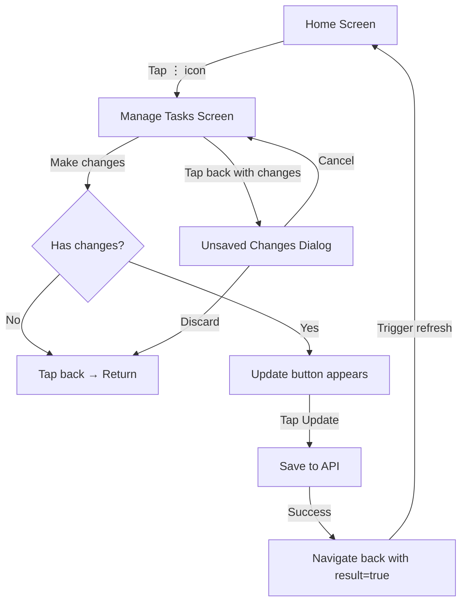

# Manage Tasks Screen

## 1. Thông Tin Chung

| Property | Value |
|----------|-------|
| **File** | `lib/ui/screens/tasks/manage_tasks_screen.dart` |
| **Route** | `/manage-tasks` |
| **Type** | `StatelessWidget` with BLoC |
| **Purpose** | Quản lý hiển thị và sắp xếp Quick Tasks |

---

## 2. Mục Đích

Màn hình cho phép user tùy chỉnh hoàn toàn Quick Tasks hiển thị trên Home:
- Sắp xếp lại thứ tự tasks (drag & drop)
- Ẩn/hiện các tasks
- Lưu thay đổi qua batch API

---

## 3. UI Components

### 3.1 Header
- Title: "Manage Tasks"
- Back button (←) - với unsaved changes warning
- **Update button** (orange) - chỉ hiện khi `hasChanges = true`

### 3.2 Subtitle
"Drag to reorder, toggle to show/hide"

### 3.3 Task List
- `ReorderableListView.builder`
- Mỗi item hiển thị:
  - Drag handle icon (≡)
  - Task icon + name + description
  - Toggle switch (ẩn/hiện)

---

## 4. User Interactions

| Element | Action | Result |
|---------|--------|--------|
| Drag handle | Long press + drag | Reorder task |
| Toggle switch | Tap | Hide/show task |
| Update button | Tap | Save all changes |
| Back button | Tap | Confirm if unsaved changes |

---

## 5. BLoC Integration

### 5.1 ManageTasksBloc

**Events:**
- `LoadManageTasks` - Load all tasks (including hidden)
- `ReorderTask` - Update sortOrder locally
- `ToggleTaskVisibility` - Update isHidden locally
- `SaveTaskChanges` - Batch save to API
- `ResetTaskChanges` - Revert to original

**States:**
- `ManageTasksInitial`
- `ManageTasksLoading` - Loading skeleton
- `ManageTasksLoaded(tasks, hasChanges)` - Main state
- `ManageTasksSaving` - Saving overlay
- `ManageTasksSaved` - Navigate back
- `ManageTasksError(message)` - Show snackbar

### 5.2 Change Tracking

Bloc maintains `_originalTasks` snapshot để detect changes:
```dart
bool _hasChanges(List<TaskModel> current) {
  // Compare current vs original
  // Check: id order, isHidden, sortOrder
}
```

---

## 6. API Integration

### 6.1 Load Tasks
```
GET /tasks?includeHidden=true
```

### 6.2 Save Changes (Batch)

**Step 1:** Toggle visibility cho tasks đã thay đổi
```
PATCH /tasks/:id/visibility
```

**Step 2:** Reorder tất cả tasks
```
POST /tasks/reorder
Body: {
  "tasks": [
    {"id": "...", "sortOrder": 0},
    {"id": "...", "sortOrder": 1},
    ...
  ]
}
```

---

## 7. Navigation Flow



---

## 8. Implementation Details

### 8.1 BLoC Registration
```dart
// service_locator.dart
sl.registerFactory(() => ManageTasksBloc(taskRepository: sl()));
```

### 8.2 Route Configuration
```dart
// app_router.dart
GoRoute(
  path: '/manage-tasks',
  name: 'manageTasks',
  pageBuilder: (context, state) => MaterialPage(
    fullscreenDialog: true,
    child: BlocProvider(
      create: (_) => sl<ManageTasksBloc>(),
      child: const ManageTasksScreen(),
    ),
  ),
)
```

### 8.3 Navigation from Home
```dart
// quick_tasks_section.dart
IconButton(
  icon: Icon(Icons.more_vert),
  onPressed: () async {
    final result = await context.push('/manage-tasks');
    if (result == true && onTasksChanged != null) {
      onTasksChanged!(); // Trigger refresh
    }
  },
)
```

---

## 9. Key Features

### 9.1 Unsaved Changes Warning
```dart
Future<bool> _showUnsavedChangesDialog() {
  return showDialog<bool>(
    context: context,
    builder: (context) => AlertDialog(
      title: Text('Unsaved Changes'),
      content: Text('Discard changes?'),
      actions: [
        TextButton('Cancel'),
        TextButton('Discard', style: destructive),
      ],
    ),
  ) ?? false;
}
```

### 9.2 Loading Overlay
Hiển thị khi đang save:
```dart
if (state is ManageTasksSaving)
  Container(
  color: Colors.black.withOpacity(0.3),
  child: Center(child: CircularProgressIndicator()),
)
```

### 9.3 Success Feedback
```dart
ScaffoldMessenger.of(context).showSnackBar(
  SnackBar(content: Text('Changes saved successfully')),
);
Navigator.of(context).pop(true); // Return true
```

---

## 10. Widget Components

### 10.1 ManageTaskItem
```dart
// lib/ui/screens/tasks/widgets/manage_task_item.dart

Widget build(BuildContext context) {
  return Container(
    key: ValueKey(task.id),
    child: Row(
      children: [
        ReorderableDragStartListener(child: Icon(≡)),
        CircleAvatar(Icon + Color),
        Column(exerciseName, taskDescription),
        Spacer(),
        Switch(task.isHidden),
      ],
    ),
  );
}
```

---

##  11. Responsive Behavior

- Màn hình scrollable để hỗ trợ nhiều tasks
- Touch targets tối thiểu 48x48dp
- Haptic feedback khi drag
- Smooth animations 60fps
