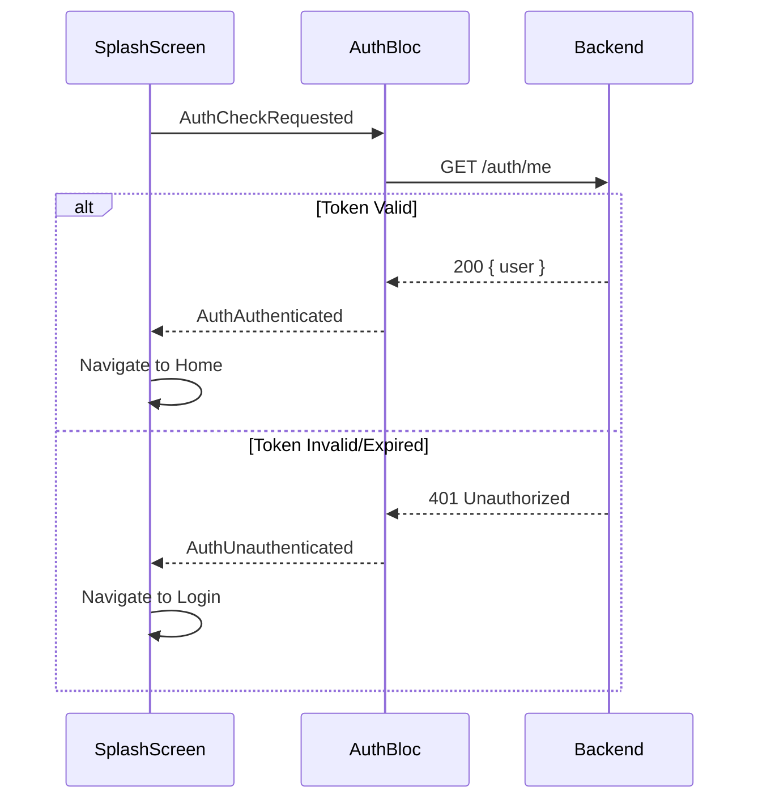
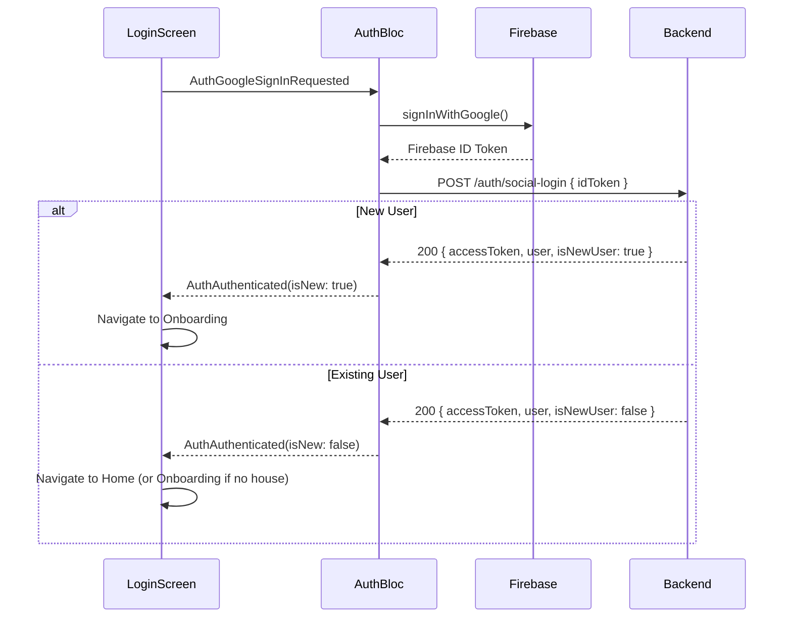
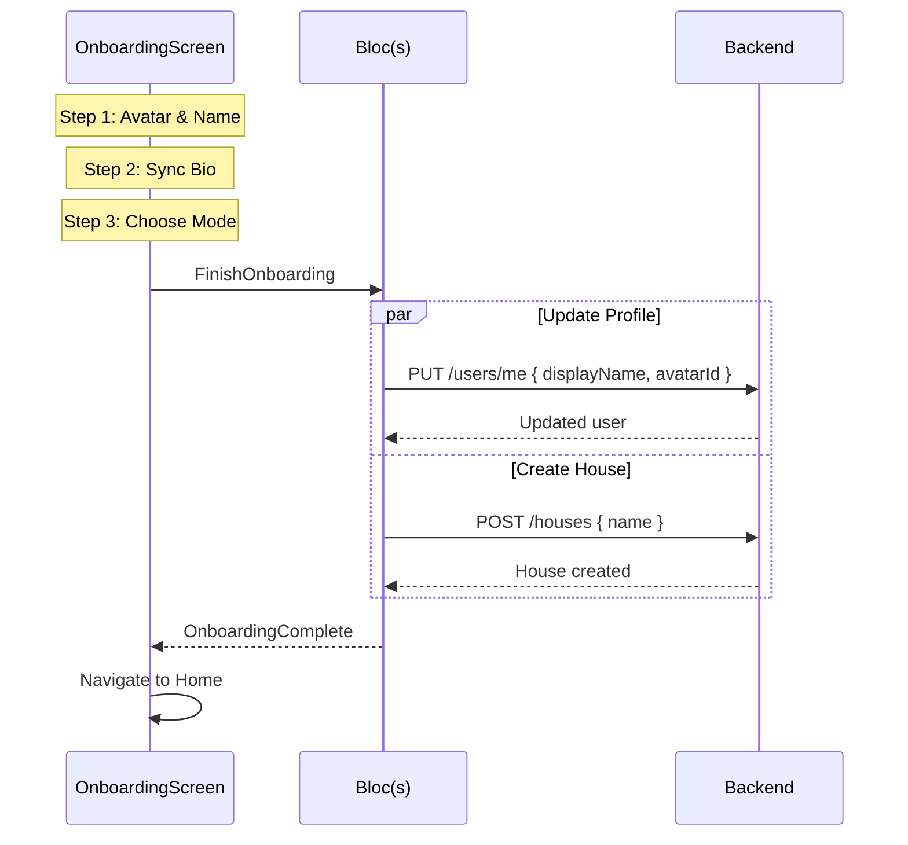
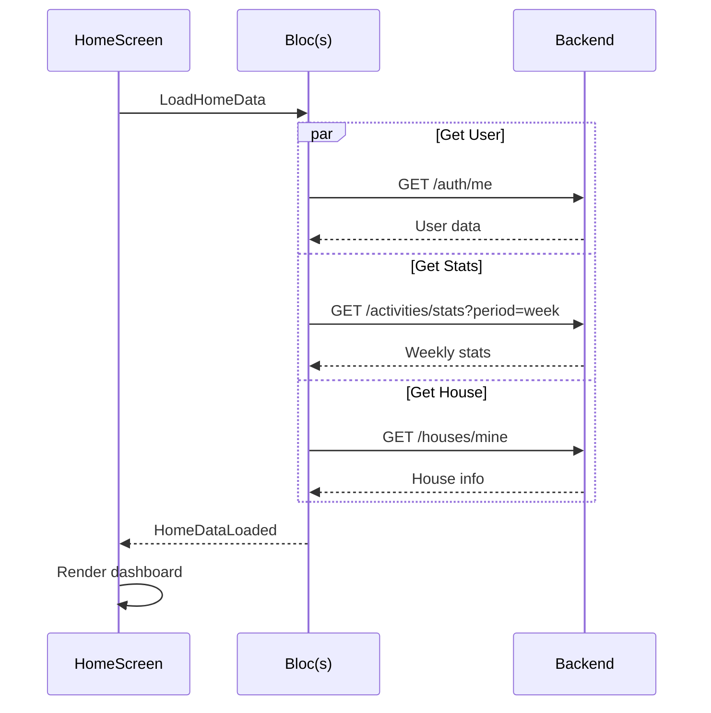
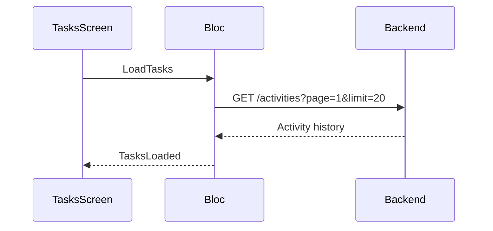
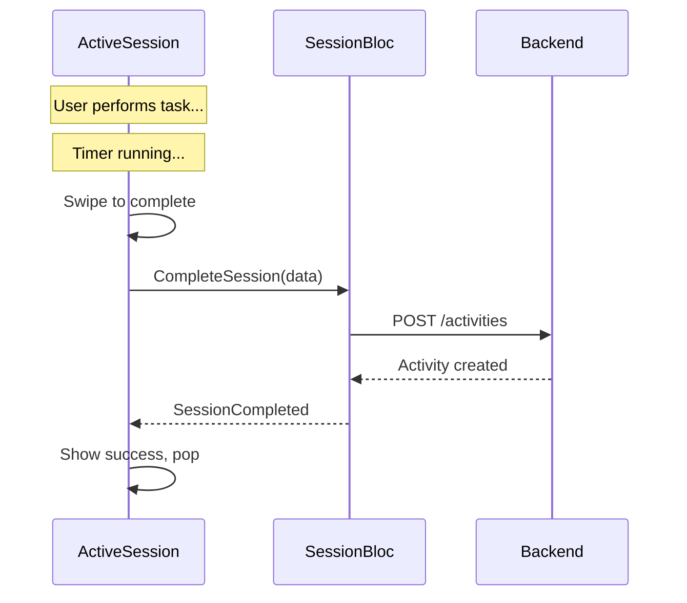
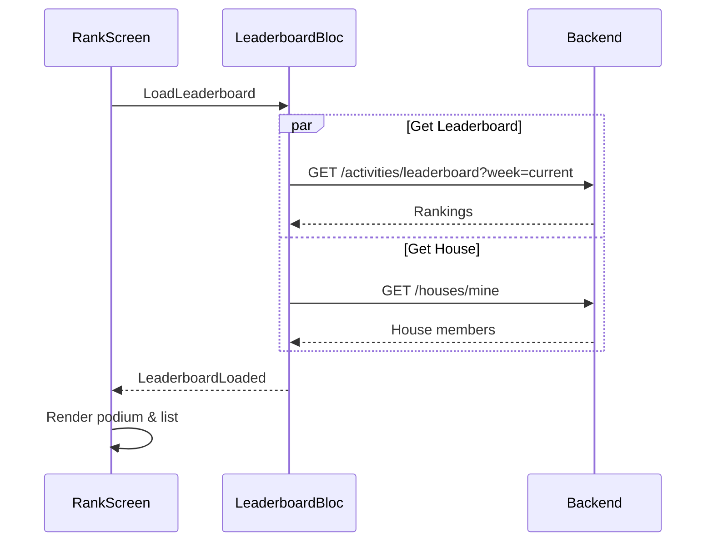
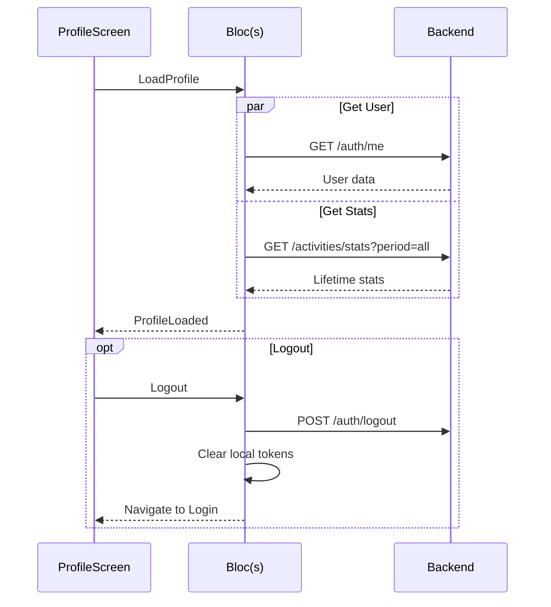

# API Integration Matrix - Tích Hợp API Cho Từng Màn Hình

## 1. Tổng Quan

Tài liệu này mô tả chi tiết việc tích hợp API cho từng màn hình của ứng dụng ErgoLife, bao gồm:
- APIs cần gọi
- Timing (khi nào gọi)
- Data mapping
- Error handling

---

## 2. API Endpoints Summary

| Module | Endpoint | Method | Auth |
|--------|----------|--------|------|
| **Auth** | `/auth/social-login` | POST | ❌ |
|  | `/auth/me` | GET | ✅ |
|  | `/auth/logout` | POST | ✅ |
| **Users** | `/users/me` | PUT | ✅ |
|  | `/users/me/fcm-token` | PUT | ✅ |
| **Houses** | `/houses` | POST | ✅ |
|  | `/houses/mine` | GET | ✅ |
|  | `/houses/join` | POST | ✅ |
|  | `/houses/leave` | POST | ✅ |
|  | `/houses/invite` | GET | ✅ |
| **Activities** | `/activities` | POST | ✅ |
|  | `/activities` | GET | ✅ |
|  | `/activities/leaderboard` | GET | ✅ |
|  | `/activities/stats` | GET | ✅ |
| **Rewards** | `/rewards` | GET | ✅ |
|  | `/rewards` | POST | ✅ |
|  | `/rewards/:id/redeem` | POST | ✅ |
| **Redemptions** | `/redemptions` | GET | ✅ |

---

## 3. Screen-API Mapping

### 3.1 Matrix Overview

| Screen | Auth | Users | Houses | Activities | Rewards |
|--------|------|-------|--------|------------|---------|
| Splash | `GET /auth/me` | - | - | - | - |
| Login | `POST /auth/social-login` | - | - | - | - |
| Onboarding | - | `PUT /users/me` | `POST /houses` | - | - |
| Home | `GET /auth/me` | - | `GET /houses/mine` | `GET /activities/stats` | - |
| Tasks | - | - | - | `GET /activities` | - |
| Create Task | - | - | - | - | - |
| Active Session | - | - | - | `POST /activities` | - |
| Rank | - | - | `GET /houses/mine` | `GET /activities/leaderboard` | - |
| Profile | `GET /auth/me` | `PUT /users/me` | `POST /houses/leave` | `GET /activities/stats` | `GET /redemptions` |

---

## 4. Detailed Screen Integration

### 4.1 SplashScreen



**APIs:**
| API | Trigger | Success | Failure |
|-----|---------|---------|---------|
| `GET /auth/me` | On init | → Home | → Login |

---

### 4.2 LoginScreen



**APIs:**
| API | Trigger | Payload | Success | Failure |
|-----|---------|---------|---------|---------|
| `POST /auth/social-login` | Google/Apple button | `{ idToken }` | → Onboarding/Home | Show error |

---

### 4.3 OnboardingScreen



**APIs:**
| API | Trigger | Payload |
|-----|---------|---------|
| `PUT /users/me` | Finish onboarding | `{ displayName, avatarId }` |
| `POST /houses` | Finish onboarding | `{ name }` |

---

### 4.4 HomeScreen



**APIs:**
| API | Purpose | Data Used |
|-----|---------|-----------|
| `GET /auth/me` | User info | `displayName` for greeting |
| `GET /activities/stats?period=week` | Weekly stats | `totalPoints`, `activityCount` |
| `GET /houses/mine` | House info | For arena comparison |

---

### 4.5 TasksScreen



**APIs:**
| API | Purpose | Query Params |
|-----|---------|--------------|
| `GET /activities` | Completed activities | `page`, `limit`, `status` |

**Note:** Active/pending tasks hiện chưa có API, sử dụng predefined list hoặc local storage.

---

### 4.6 CreateTaskScreen

**Currently:** Không gọi API - chỉ local.

**Future:**
| API | Purpose | Payload |
|-----|---------|---------|
| `POST /tasks/custom` | Save custom task | `{ exerciseName, description, duration, metsValue, icon }` |

---

### 4.7 ActiveSessionScreen



**APIs:**
| API | Trigger | Payload |
|-----|---------|---------|
| `POST /activities` | Swipe complete | `{ taskName, durationSeconds, metsValue, magicWipePercentage }` |

**Response Data Used:**
- `pointsEarned` - Show in success animation
- `wallet.newBalance` - Update UI if visible
- `bonusMultiplier` - Show bonus indicator

---

### 4.8 RankScreen



**APIs:**
| API | Purpose | Query Params |
|-----|---------|--------------|
| `GET /activities/leaderboard` | Weekly rankings | `week` (e.g., `2025-W51`) |
| `GET /houses/mine` | House members | - |
| `GET /houses/invite` | Invite code (for button) | - |

---

### 4.9 ProfileScreen



**APIs:**
| API | Purpose |
|-----|---------|
| `GET /auth/me` | User info |
| `GET /activities/stats?period=all` | Lifetime stats |
| `PUT /users/me` | Edit profile |
| `POST /auth/logout` | Logout |
| `POST /houses/leave` | Leave house |
| `GET /redemptions` | Redemption history |

---

## 5. Error Handling Strategy

### 5.1 Common Error Codes

| Code | Message | Action |
|------|---------|--------|
| 401 | Unauthorized | Redirect to login |
| 403 | Forbidden | Show permission error |
| 404 | Not Found | Show not found message |
| 422 | Validation Error | Show field errors |
| 500 | Server Error | Show retry option |
| Network | No connection | Show offline mode |

### 5.2 Global Error Handler

```dart
class ApiErrorHandler {
  static void handle(BuildContext context, ApiError error) {
    switch (error.code) {
      case 401:
        // Clear auth, navigate to login
        context.read<AuthBloc>().add(AuthSessionExpired());
        context.go(AppRouter.login);
        break;
      case 403:
        showSnackBar(context, 'You do not have permission');
        break;
      default:
        showSnackBar(context, error.message);
    }
  }
}
```

---

## 6. Caching Strategy

### 6.1 Cache Rules

| Data | Cache Duration | Invalidation |
|------|----------------|--------------|
| User profile | 5 minutes | On update |
| Weekly stats | 5 minutes | On activity creation |
| Leaderboard | 1 minute | On pull refresh |
| House info | 10 minutes | On join/leave |
| Activities list | 5 minutes | On activity creation |

### 6.2 Implementation

```dart
class CachedRepository {
  final _cache = <String, CacheEntry>{};
  
  Future<T> getOrFetch<T>(
    String key,
    Future<T> Function() fetcher, {
    Duration ttl = const Duration(minutes: 5),
  }) async {
    final entry = _cache[key];
    if (entry != null && !entry.isExpired) {
      return entry.data as T;
    }
    
    final data = await fetcher();
    _cache[key] = CacheEntry(data, ttl);
    return data;
  }
}
```

---

## 7. Loading States

### 7.1 Per Screen

| Screen | Loading UI |
|--------|------------|
| Splash | Progress bar |
| Login | Circular indicator |
| Home | Skeleton/shimmer |
| Tasks | Skeleton list |
| Rank | Skeleton podium |
| Profile | Skeleton cards |

### 7.2 Implementation

```dart
BlocBuilder<HomeBloc, HomeState>(
  builder: (context, state) {
    if (state is HomeLoading) {
      return HomeSkeletonScreen();
    }
    if (state is HomeError) {
      return ErrorScreen(
        message: state.message,
        onRetry: () => context.read<HomeBloc>().add(LoadHome()),
      );
    }
    return HomeContent(state.data);
  },
)
```

---

## 8. Realtime Updates (Future)

### 8.1 WebSocket Events

| Event | Screens Affected | Action |
|-------|------------------|--------|
| `activity.created` | Rank, Home | Refresh leaderboard |
| `reward.redeemed` | (Notification) | Show notification |
| `house.member.joined` | Rank | Refresh house members |
| `house.member.left` | Rank | Refresh house members |

### 8.2 Implementation (Future)

```dart
class RealtimeService {
  late WebSocketChannel _channel;
  
  void connect(String token) {
    _channel = WebSocketChannel.connect(
      Uri.parse('wss://api.ergolife.app/ws?token=$token'),
    );
    
    _channel.stream.listen((event) {
      final data = jsonDecode(event);
      _eventController.add(RealtimeEvent.fromJson(data));
    });
  }
}
```
